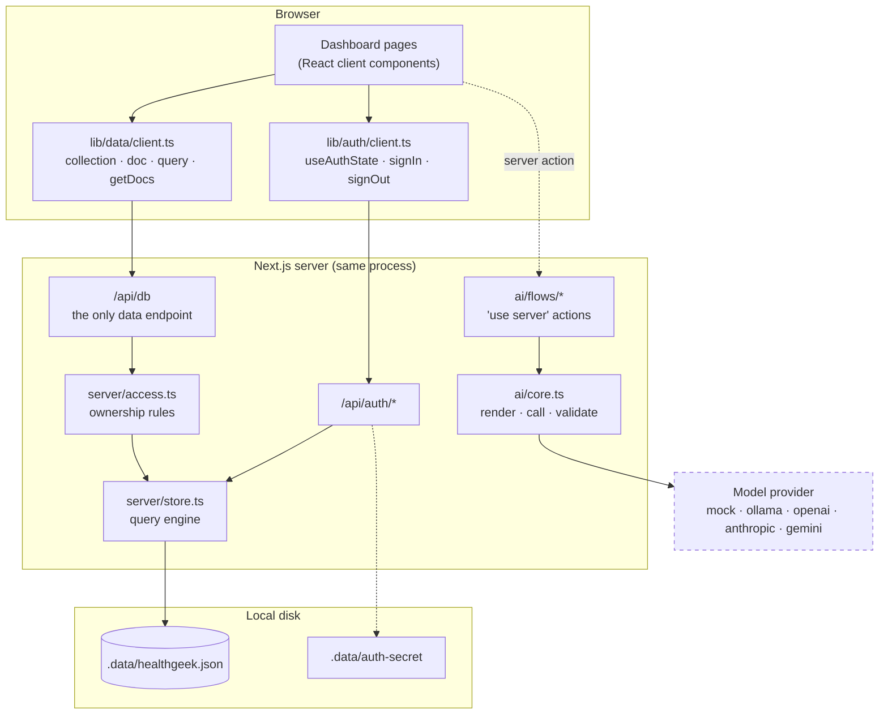
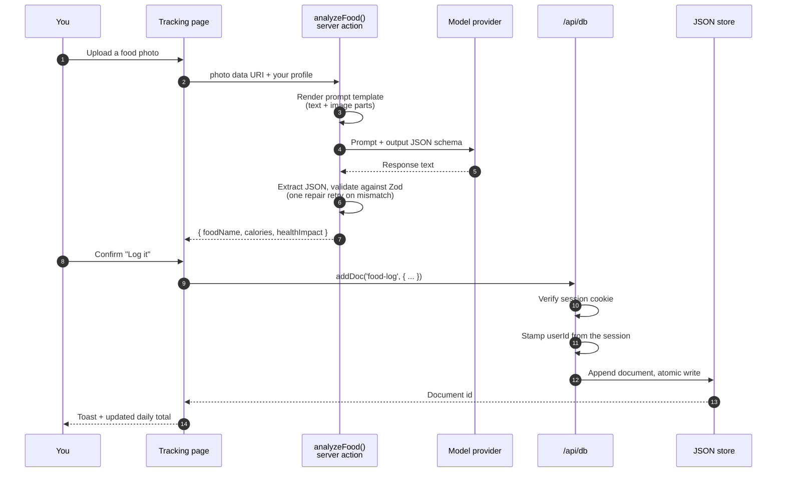
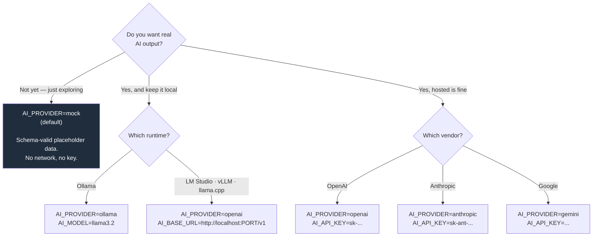

# HealthGeek.ai

AI-powered personal health tracking: log meals, workouts and meditation, upload lab
reports for analysis, and get recommendations tailored to your health profile.

**It runs entirely on your machine.** No cloud project, no vendor SDK, no API key
required to start. Data is a JSON file on disk, auth is a signed cookie, and the AI layer
is a set of interchangeable adapters — including an offline one that needs no model at all.

```bash
npm install
npm run dev          # http://localhost:9002
```

Sign up with any email and a 6+ character password. Your data lands in `./.data/healthgeek.json`.

---

## How it works

Three moving parts, each swappable, none tied to a hosted service.



The dashed provider box is the only thing that can leave your machine — and only if you
configure it. With the default `AI_PROVIDER=mock`, nothing does.

### What happens when you log a meal



Two things worth noticing. The AI call and the database write are **separate steps** — the
model never touches storage, and nothing is saved until you confirm. And the `userId` on
the new document comes from the session cookie, not from the browser, so a page cannot
write a record owned by somebody else.

---

## AI providers

The app ships with a provider that needs nothing installed, so every screen works
immediately. Swap it when you want real analysis.



Fully local in two commands:

```bash
ollama pull llama3.2
echo "AI_PROVIDER=ollama" >> .env.local
```

**Media support differs by provider.** Food photos and lab reports need a vision-capable
model (`llava`, `gpt-4o`, Claude, Gemini). The posture analyzer sends *video*, which only
`gemini` accepts. A provider that cannot read an attachment says so in the prompt instead
of silently pretending it saw one.

---

## Configuration

Copy `.env.example` to `.env.local`. Every value has a working default — an empty file is
a valid configuration.

| Variable | Default | Purpose |
|---|---|---|
| `AUTH_SECRET` | generated | Signs session cookies. If unset, a random 32-byte secret is written to `<data dir>/auth-secret`. Set it explicitly if you run more than one instance. |
| `HEALTHGEEK_DATA_DIR` | `./.data` | Where `healthgeek.json` lives. |
| `AI_PROVIDER` | `mock` | `mock`, `ollama`, `openai`, `anthropic`, or `gemini`. |
| `AI_MODEL` | per provider | `llama3.2`, `gpt-4o-mini`, `claude-opus-5`, `gemini-2.0-flash`. |
| `AI_API_KEY` | — | Credential for the chosen provider. Not needed for `mock` or `ollama`. |
| `AI_BASE_URL` | per provider | Override the endpoint — how you point at LM Studio, vLLM, or a gateway. |
| `AI_MAX_TOKENS` | `8192` | Response cap for the `anthropic` provider. |

---

## Features

| Feature | Where | Needs a model? |
|---|---|---|
| Meal, workout and meditation logs | Tracking | No (photo analysis does) |
| Photo-based calorie estimation | Tracking, Analysis | Yes — vision |
| Lab report extraction and interpretation | Analysis | Yes — vision |
| Posture assessment from video | Analysis | Yes — `gemini` only |
| Recipe, workout, meditation and habit plans | Recommendations | Yes |
| Health quizzes | Health Quiz | Yes |
| Activity counts | Insights | No |
| PDF exports with date filtering | Reports | No |

---

## Running in a container

```bash
export AUTH_SECRET=$(node -e "console.log(require('crypto').randomBytes(32).toString('hex'))")
docker compose up --build       # http://localhost:9002
```

`next.config.ts` sets `output: 'standalone'`, so the image carries its own server bundle.
The document store lives on a named volume and survives restarts.

---

## Data and privacy

Everything stays on the machine running the app: accounts, health logs, uploaded reports
and photos. Passwords are stored as scrypt hashes with per-user salts, never in plain text.

The only outbound traffic is to the model provider you configure. With `AI_PROVIDER=mock`
there is none.

`.data/` is gitignored. Delete it to reset the app completely — accounts included.

---

## Troubleshooting

| Symptom | Cause | Fix |
|---|---|---|
| `EADDRINUSE` on start | Something already holds port 9002 | `npx next dev -p 9200` |
| Everything says "Sample …" | `AI_PROVIDER` is still `mock` | Configure a provider (above) |
| "Could not reach …" on an AI action | Model server is down, or `AI_BASE_URL` is wrong | Check the endpoint is up |
| Photo analysis returns generic text | Model has no vision | Use a vision-capable model |
| Logged out after restart | `AUTH_SECRET` changed, or `.data/auth-secret` was deleted | Pin `AUTH_SECRET` in `.env.local` |
| `npm run lint` opens a prompt | ESLint was never configured in this repo | Use `npm run typecheck` |

---

## Documentation

| Section | What it answers |
|---|---|
| [docs/architecture/](./docs/architecture/) | How the parts fit, the data model, the trust boundary, deployment |
| [docs/code/](./docs/code/) | Module map, the data and AI APIs, and how to extend them |
| [docs/design/](./docs/design/) | Design system, navigation, user journeys |
| [docs/testing/](./docs/testing/) | What is verified today and how to verify it yourself |
| [docs/presentation/](./docs/presentation/) | Product overview and demo script |

## Scripts

| Command | Purpose |
|---|---|
| `npm run dev` | Dev server on port 9002 (Turbopack) |
| `npm run build` | Production build |
| `npm start` | Serve the production build |
| `npm run typecheck` | TypeScript check — clean from a cold `.next` |
| `npm run lint` | ESLint (not yet configured; drops into its setup prompt) |
