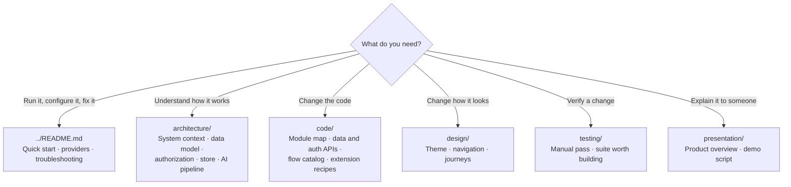
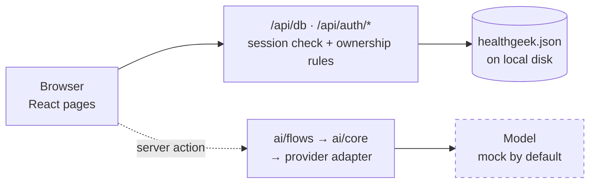

# HealthGeek Documentation

**HealthGeek.ai** is an AI-powered personal health tracker that runs entirely on one
machine — no cloud project, no vendor SDK, no API key required to start.

---

## Where to go



| Section | Answers |
|---|---|
| [architecture/](./architecture/) | How do the pieces fit? Where is the trust boundary? What are the limits? |
| [code/](./code/) | Where does X live? What's the data API? How do I add a collection, provider, or flow? |
| [design/](./design/) | What's the theme and navigation? What do the user journeys look like? |
| [testing/](./testing/) | What's verified today, and how do I verify my change? |
| [presentation/](./presentation/) | What does this product do and why? |

---

## The shape of the system



Three replaceable seams, each isolated to one directory:

| Concern | Lives in | Swap it by |
|---|---|---|
| Storage | `src/lib/server/store.ts` | Reimplementing one module's exports |
| Authorization | `src/lib/server/access.ts` | Editing the rules in place |
| AI vendor | `src/ai/providers/` | Adding an adapter and an `AI_PROVIDER` value |

---

## Repository tour

```
src/
├── app/
│   ├── page.tsx              landing
│   ├── login/ · signup/
│   ├── dashboard/            layout.tsx is the auth gate + sidebar
│   │   ├── insights/         activity counts
│   │   ├── analysis/         lab reports, posture, food photos
│   │   ├── tracking/         meal · workout · meditation logs
│   │   ├── recommendations/  AI plans + saved history
│   │   ├── health-quiz/      generated quizzes
│   │   ├── reports/          PDF export
│   │   └── profile/          the profile that personalizes everything
│   └── api/
│       ├── db/               the only data endpoint
│       └── auth/             signup · login · logout · session
├── lib/
│   ├── data/                 client-side document API + wire codec
│   ├── auth/                 client-side session API
│   └── server/               store · access rules · password + cookies
├── ai/
│   ├── core.ts               definePrompt / defineFlow
│   ├── template.ts           Handlebars subset
│   ├── json-schema.ts        Zod → JSON Schema
│   ├── providers/            one adapter per vendor
│   └── flows/                one AI feature per file
├── components/ui/            shadcn (Radix + Tailwind)
└── hooks/
```

---

## Quick reference

| Command | Purpose |
|---|---|
| `npm run dev` | Dev server on port 9002 |
| `npm run build` | Production build |
| `npm start` | Serve the production build |
| `npm run typecheck` | TypeScript check — clean from a cold `.next` |

| Variable | Default | Purpose |
|---|---|---|
| `AI_PROVIDER` | `mock` | Which model adapter to use |
| `HEALTHGEEK_DATA_DIR` | `./.data` | Where the JSON store lives |
| `AUTH_SECRET` | generated | Signs session cookies |

Full configuration in the [root README](../README.md#configuration).

## Tech stack

| Layer | Technology |
|---|---|
| Framework | Next.js 15 (App Router, Turbopack), React 18, TypeScript |
| Storage | JSON document store on local disk |
| Auth | Email + password (scrypt), HMAC-signed session cookie |
| AI | Pluggable `fetch`-based adapters: mock, Ollama, OpenAI-compatible, Anthropic, Gemini |
| UI | shadcn/ui (Radix + Tailwind), Lucide icons, Recharts, Framer Motion |
| Forms | React Hook Form + Zod |
| PDF | jsPDF + jspdf-autotable |
| Deployment | Any Node 22 host; Dockerfile and compose file included |

## Known gaps

Documented so nobody rediscovers them the hard way:

- `src/app/dashboard/food-assessment/page.tsx` and `src/ai/flows/food-assessor.ts` are
  empty stubs; that route renders nothing.
- `npm run lint` drops into ESLint's interactive setup — ESLint was never configured.
- No automated tests exist. See [testing/](./testing/).
- The app is hardcoded to dark mode; the light palette in `globals.css` is unreachable.
