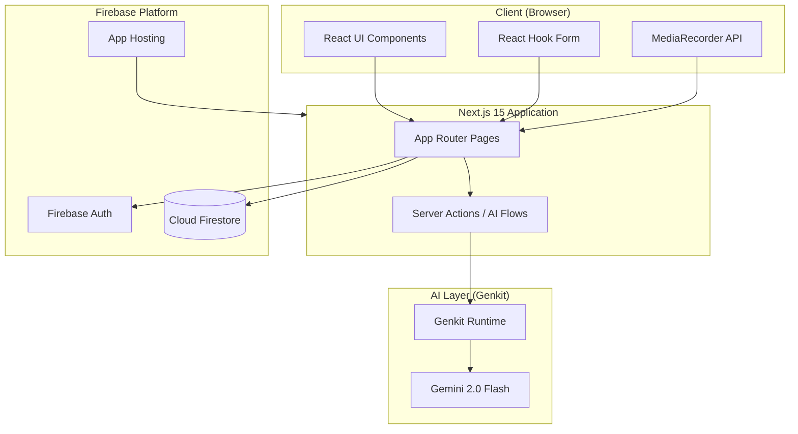
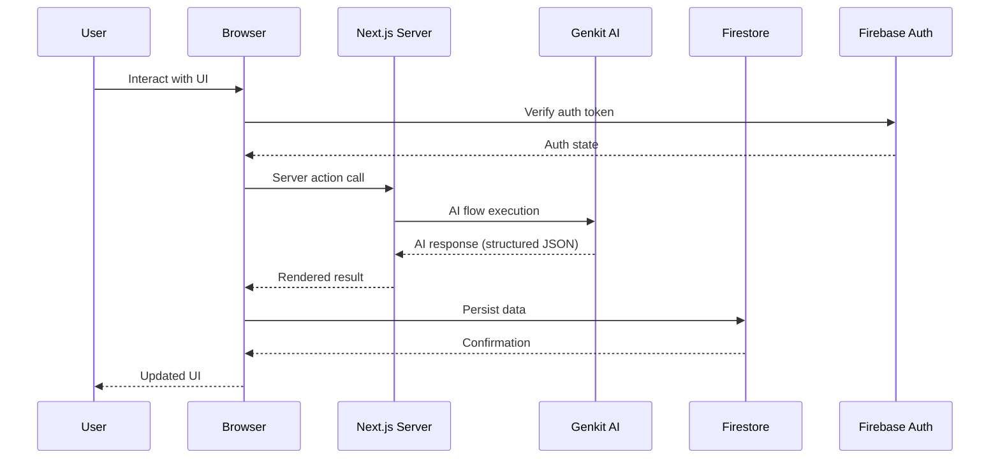
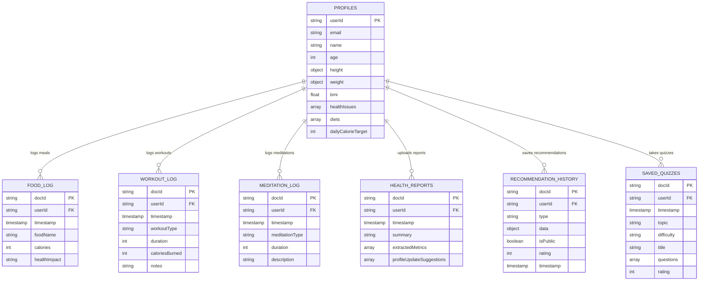
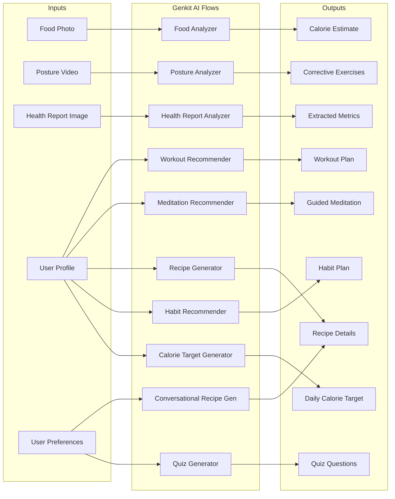
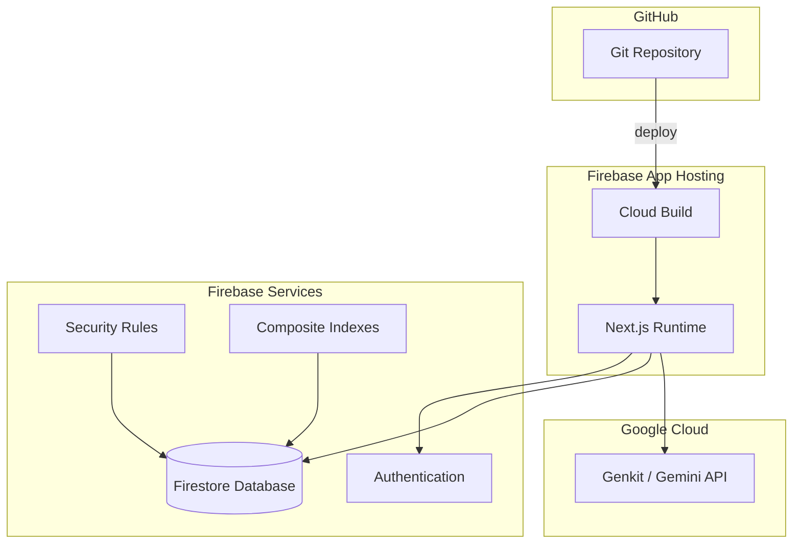
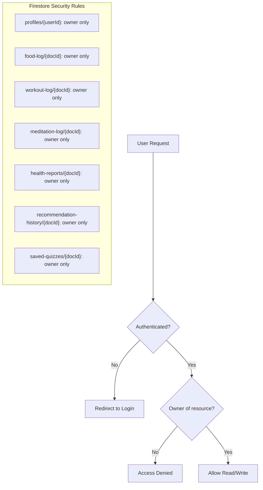
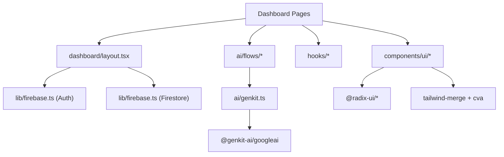

# Architecture

## System Overview

HealthGeek is a full-stack AI health platform built on Next.js with Firebase infrastructure and Google Genkit AI pipelines.

## Request Flow

## Data Architecture

## AI Pipeline Architecture

## Deployment Architecture

## Security Model

## Module Dependency Graph

