# Architecture

HealthGeek is a single Next.js process plus a JSON file. That is the whole system. This
document explains how the pieces fit, where the trust boundary sits, and why the storage
and AI layers are shaped the way they are.

---

## System context

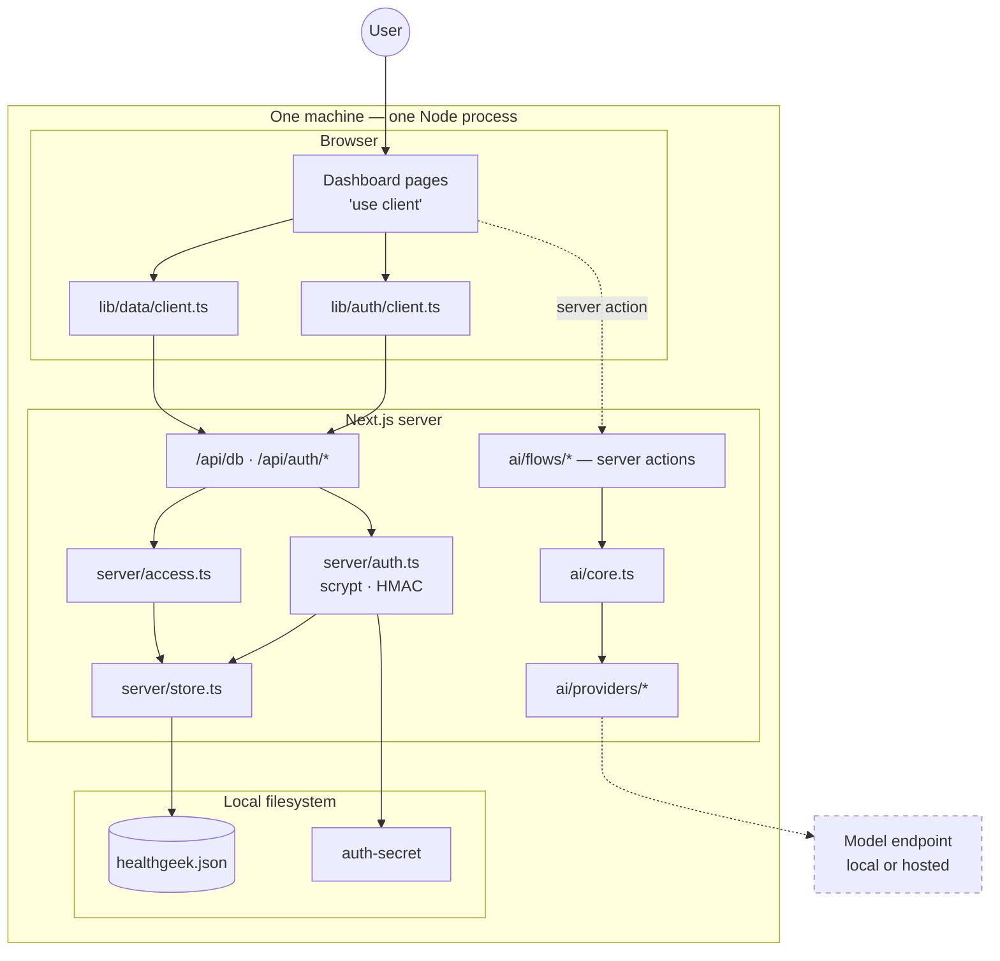
```mermaid
flowchart TB
    user(("User"))

    subgraph machine ["One machine — one Node process"]
        subgraph client ["Browser"]
            pages["Dashboard pages<br/>'use client'"]
            dc["lib/data/client.ts"]
            ac["lib/auth/client.ts"]
        end

        subgraph srv ["Next.js server"]
            api["/api/db · /api/auth/*"]
            rules["server/access.ts"]
            store["server/store.ts"]
            auth["server/auth.ts<br/>scrypt · HMAC"]
            actions["ai/flows/* — server actions"]
            core["ai/core.ts"]
            prov["ai/providers/*"]
        end

        subgraph fs ["Local filesystem"]
            data[("healthgeek.json")]
            sec["auth-secret"]
        end
    end

    ext["Model endpoint<br/>local or hosted"]

    user --> pages
    pages --> dc --> api
    pages --> ac --> api
    pages -.->|"server action"| actions
    api --> rules --> store --> data
    api --> auth --> sec
    auth --> store
    actions --> core --> prov -.-> ext

    style ext stroke-dasharray: 5 5
```

Everything inside `machine` is one `next` process. The dashed edge is the only network
egress, and it exists only when `AI_PROVIDER` is not `mock`.

### Why there is an API route at all

The browser cannot open a file on the server's disk, so the store needs a network surface.
That surface is also where authorization lives. Under the previous Firestore design the
browser held a database handle directly and security rules were evaluated by the database.
Here `/api/db` is a chokepoint: one endpoint, one session check, one place where ownership
is decided.

---

## Request lifecycle

Every data operation follows the same steps.

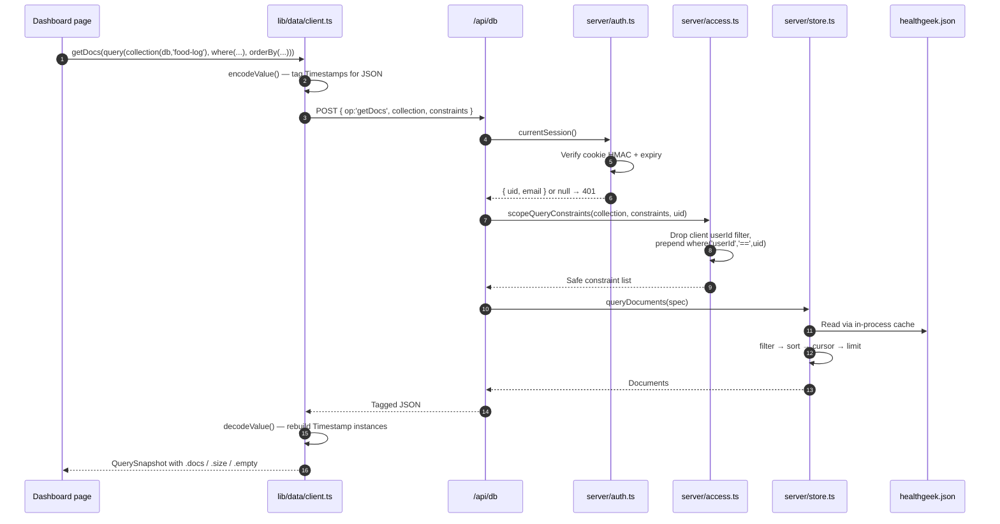
```mermaid
sequenceDiagram
    autonumber
    participant Page as Dashboard page
    participant Client as lib/data/client.ts
    participant Route as /api/db
    participant Auth as server/auth.ts
    participant Access as server/access.ts
    participant Store as server/store.ts
    participant Disk as healthgeek.json

    Page->>Client: getDocs(query(collection(db,'food-log'), where(...), orderBy(...)))
    Client->>Client: encodeValue() — tag Timestamps for JSON
    Client->>Route: POST { op:'getDocs', collection, constraints }
    Route->>Auth: currentSession()
    Auth->>Auth: Verify cookie HMAC + expiry
    Auth-->>Route: { uid, email } or null → 401
    Route->>Access: scopeQueryConstraints(collection, constraints, uid)
    Access->>Access: Drop client userId filter,<br/>prepend where('userId','==',uid)
    Access-->>Route: Safe constraint list
    Route->>Store: queryDocuments(spec)
    Store->>Disk: Read via in-process cache
    Store->>Store: filter → sort → cursor → limit
    Store-->>Route: Documents
    Route-->>Client: Tagged JSON
    Client->>Client: decodeValue() — rebuild Timestamp instances
    Client-->>Page: QuerySnapshot with .docs / .size / .empty
```

The `encodeValue`/`decodeValue` steps exist because JSON has no date type — see
[Timestamps on the wire](#timestamps-on-the-wire).

---

## Data model

Six user-owned collections plus one profile per user. Documents are plain JSON objects
with string ids.

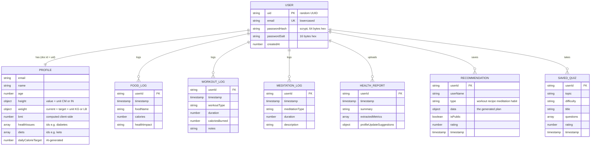
```mermaid
erDiagram
    USER ||--|| PROFILE : "has (doc id = uid)"
    USER ||--o{ FOOD_LOG : logs
    USER ||--o{ WORKOUT_LOG : logs
    USER ||--o{ MEDITATION_LOG : logs
    USER ||--o{ HEALTH_REPORT : uploads
    USER ||--o{ RECOMMENDATION : saves
    USER ||--o{ SAVED_QUIZ : takes

    USER {
        string uid PK "random UUID"
        string email UK "lowercased"
        string passwordHash "scrypt, 64 bytes hex"
        string passwordSalt "16 bytes hex"
        number createdAt
    }
    PROFILE {
        string email
        string name
        number age
        object height "value + unit CM or IN"
        object weight "current + target + unit KG or LB"
        number bmi "computed client-side"
        array healthIssues "ids e.g. diabetes"
        array diets "ids e.g. keto"
        number dailyCalorieTarget "AI-generated"
    }
    FOOD_LOG {
        string userId FK
        timestamp timestamp
        string foodName
        number calories
        string healthImpact
    }
    WORKOUT_LOG {
        string userId FK
        timestamp timestamp
        string workoutType
        number duration
        number caloriesBurned
        string notes
    }
    MEDITATION_LOG {
        string userId FK
        timestamp timestamp
        string meditationType
        number duration
        string description
    }
    HEALTH_REPORT {
        string userId FK
        timestamp timestamp
        string summary
        array extractedMetrics
        object profileUpdateSuggestions
    }
    RECOMMENDATION {
        string userId FK
        string userName
        string type "workout recipe meditation habit"
        object data "the generated plan"
        boolean isPublic
        number rating
        timestamp timestamp
    }
    SAVED_QUIZ {
        string userId FK
        string topic
        string difficulty
        string title
        array questions
        number rating
        timestamp timestamp
    }
```

Two different ownership shapes, and the distinction drives authorization:

- **`profiles`** is keyed *by* the owner — the document id **is** the uid. There is no
  `userId` field, and it cannot be queried, only fetched by id.
- **Everything else** carries a `userId` field, gets a random id, and is queried.

### The file on disk

```jsonc
{
  "version": 1,
  "users": [
    { "uid": "…", "email": "…", "passwordHash": "…", "passwordSalt": "…", "createdAt": 0 }
  ],
  "collections": {
    "profiles": { "<uid>": { "name": "…", "bmi": 24.2 } },
    "food-log": {
      "<random>": {
        "userId": "…",
        "foodName": "…",
        "timestamp": { "__healthgeek_timestamp": { "seconds": 0, "nanoseconds": 0 } }
      }
    }
  }
}
```

Credentials and documents live in one file. That is fine for a single-user local app and is
the first thing to revisit before any shared deployment — see [Limits](#limits).

---

## Authorization

The rules that used to live in `firestore.rules` are now code, evaluated on every request
before the store is touched.

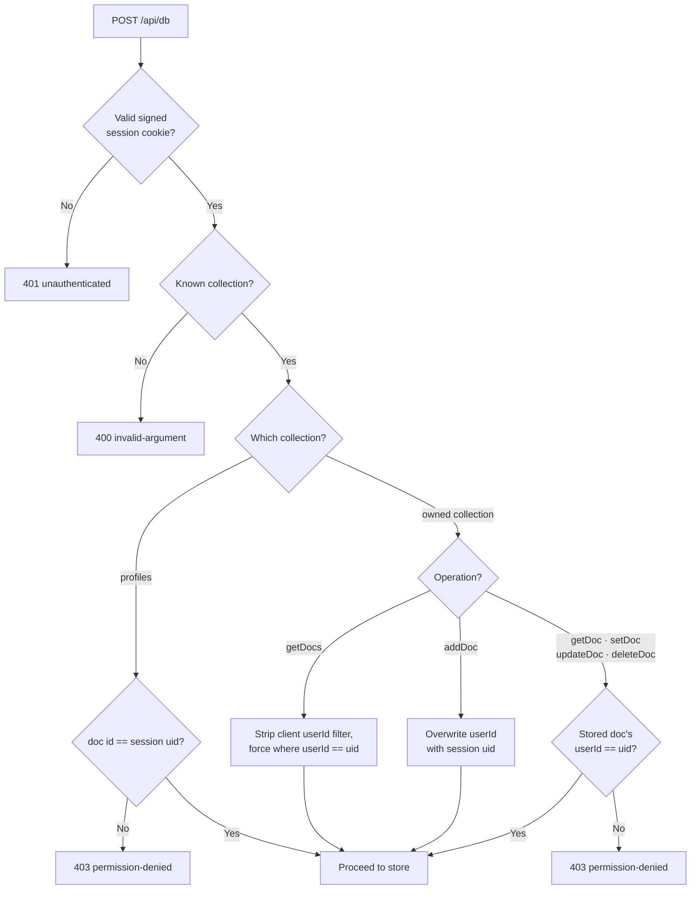
```mermaid
flowchart TD
    req["POST /api/db"] --> sess{"Valid signed<br/>session cookie?"}
    sess -->|No| c401["401 unauthenticated"]
    sess -->|Yes| known{"Known collection?"}
    known -->|No| c400["400 invalid-argument"]
    known -->|Yes| kind{"Which collection?"}

    kind -->|profiles| pid{"doc id == session uid?"}
    pid -->|No| c403a["403 permission-denied"]
    pid -->|Yes| ok["Proceed to store"]

    kind -->|"owned collection"| op{"Operation?"}
    op -->|getDocs| scope["Strip client userId filter,<br/>force where userId == uid"]
    scope --> ok
    op -->|addDoc| stamp["Overwrite userId<br/>with session uid"]
    stamp --> ok
    op -->|"getDoc · setDoc<br/>updateDoc · deleteDoc"| owns{"Stored doc's<br/>userId == uid?"}
    owns -->|No| c403b["403 permission-denied"]
    owns -->|Yes| ok
```

Three properties this buys:

1. **A forged filter cannot widen a result set.** `scopeQueryConstraints` removes any
   client-supplied `userId` clause and prepends its own, so
   `where('userId','==',someoneElse)` returns the caller's own rows, not theirs.
2. **A forged owner cannot be written.** `addDoc` overwrites `userId` from the session.
3. **Cross-user access fails closed.** Single-document operations load the stored document
   and compare its `userId` before acting.

`profiles` is deliberately excluded from querying — `scopeQueryConstraints` rejects it —
because a profile has no `userId` field to filter on.

### Trust boundary

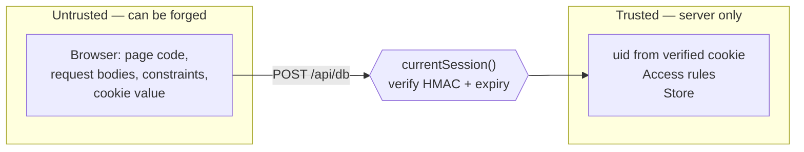
```mermaid
flowchart LR
    subgraph untrusted ["Untrusted — can be forged"]
        b["Browser: page code,<br/>request bodies, constraints,<br/>cookie value"]
    end
    subgraph trusted ["Trusted — server only"]
        s["uid from verified cookie<br/>Access rules<br/>Store"]
    end
    b -->|"POST /api/db"| gate{{"currentSession()<br/>verify HMAC + expiry"}}
    gate --> s
```

The cookie is `httpOnly`, `sameSite=lax`, and `secure` in production. It carries
`{ uid, email, exp }` signed with HMAC-SHA256; a tampered payload fails the constant-time
signature comparison and is treated as no session at all.

---

## The store

### Reads are cached, writes are serialized

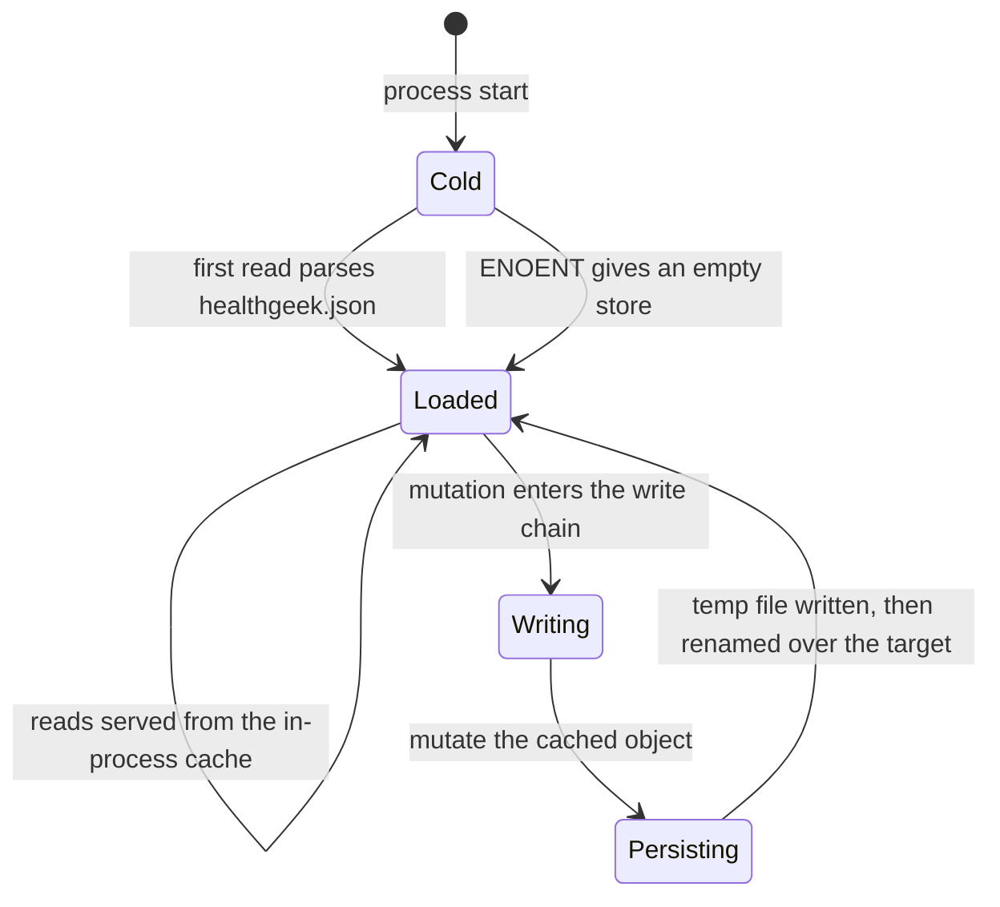
```mermaid
stateDiagram-v2
    [*] --> Cold: process start
    Cold --> Loaded: first read parses healthgeek.json
    Cold --> Loaded: ENOENT gives an empty store
    Loaded --> Loaded: reads served from the in-process cache
    Loaded --> Writing: mutation enters the write chain
    Writing --> Persisting: mutate the cached object
    Persisting --> Loaded: temp file written, then renamed over the target
```

Two deliberate choices:

- **`withWriteLock()` chains every mutation onto one promise**, so concurrent requests
  cannot interleave a read-modify-write. A rejected mutation does not break the chain —
  the next writer still runs.
- **Write-then-rename**, so a crash mid-write leaves the previous file intact rather than a
  truncated one.

### Query evaluation order

Constraints are applied in Firestore's order, which is what the page code expects:

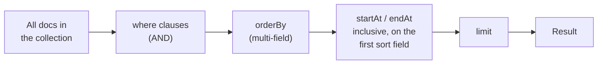
```mermaid
flowchart LR
    all["All docs in<br/>the collection"] --> w["where clauses<br/>(AND)"]
    w --> o["orderBy<br/>(multi-field)"]
    o --> c["startAt / endAt<br/>inclusive, on the<br/>first sort field"]
    c --> l["limit"]
    l --> out["Result"]
```

Supported operators: `==`, `!=`, `<`, `<=`, `>`, `>=`, `in`, `not-in`, `array-contains`.

The cursor step is what makes the search boxes work: `orderBy('foodName')` with
`startAt(text)` and `endAt(text + '')` is a prefix match, because `U+F8FF` sorts above
any ordinary character.

**There are no indexes.** Every query is a linear scan of the collection. At single-user
scale that is microseconds; it is the first thing to change if this becomes multi-tenant.

### Timestamps on the wire

JSON has no date type, so values are tagged in transit and rebuilt on arrival. This is why
`doc.data().timestamp.toDate()` still works in page code written against Firestore.

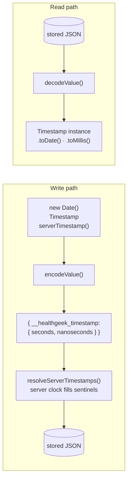
```mermaid
flowchart LR
    subgraph write ["Write path"]
        d1["new Date()<br/>Timestamp<br/>serverTimestamp()"] --> e["encodeValue()"]
        e --> t1["{ __healthgeek_timestamp:<br/>{ seconds, nanoseconds } }"]
        t1 --> r["resolveServerTimestamps()<br/>server clock fills sentinels"]
        r --> f[("stored JSON")]
    end
    subgraph read ["Read path"]
        f2[("stored JSON")] --> dec["decodeValue()"]
        dec --> ts["Timestamp instance<br/>.toDate() · .toMillis()"]
    end
```

The query engine compares tagged timestamps as milliseconds via `comparableOf()`, so range
filters work without decoding the whole collection.

---

## The AI layer

A flow is a prompt template plus a Zod schema. `core.ts` turns that into a validated object,
whichever provider is configured.

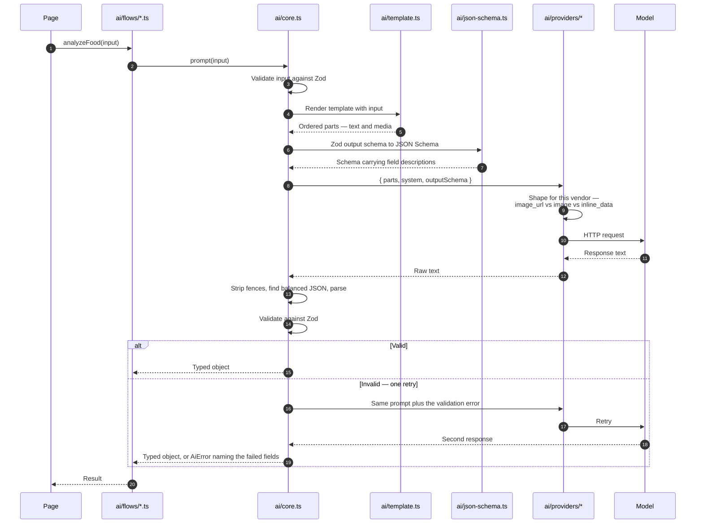
```mermaid
sequenceDiagram
    autonumber
    participant Page
    participant Flow as ai/flows/*.ts
    participant Core as ai/core.ts
    participant Tpl as ai/template.ts
    participant Sch as ai/json-schema.ts
    participant Prov as ai/providers/*
    participant Model

    Page->>Flow: analyzeFood(input)
    Flow->>Core: prompt(input)
    Core->>Core: Validate input against Zod
    Core->>Tpl: Render template with input
    Tpl-->>Core: Ordered parts — text and media
    Core->>Sch: Zod output schema to JSON Schema
    Sch-->>Core: Schema carrying field descriptions
    Core->>Prov: { parts, system, outputSchema }
    Prov->>Prov: Shape for this vendor —<br/>image_url vs image vs inline_data
    Prov->>Model: HTTP request
    Model-->>Prov: Response text
    Prov-->>Core: Raw text
    Core->>Core: Strip fences, find balanced JSON, parse
    Core->>Core: Validate against Zod

    alt Valid
        Core-->>Flow: Typed object
    else Invalid — one retry
        Core->>Prov: Same prompt plus the validation error
        Prov->>Model: Retry
        Model-->>Core: Second response
        Core-->>Flow: Typed object, or AiError naming the failed fields
    end
    Flow-->>Page: Result
```

### Provider capabilities

| Provider | Endpoint | Text | Images | Video | Key |
|---|---|---|---|---|---|
| `mock` | none | ✅ synthesized | n/a | n/a | no |
| `openai` | OpenAI chat-completions (also Ollama, LM Studio, vLLM, gateways) | ✅ | ✅ vision models | ❌ | usually |
| `ollama` | `localhost:11434/v1` | ✅ | ✅ vision models | ❌ | no |
| `anthropic` | Messages API | ✅ | ✅ | ❌ | yes |
| `gemini` | Generative Language API | ✅ | ✅ | ✅ | yes |

Every adapter is plain `fetch` — no vendor SDK is installed. When a provider cannot read an
attached medium it appends an explicit note to the prompt saying so, rather than dropping it
silently and letting the model invent an answer.

### The prompt template language

`template.ts` implements the Handlebars subset the flows actually use:

| Syntax | Meaning |
|---|---|
| `{{{field}}}` / `{{field}}` | Interpolation, dotted paths allowed. No HTML escaping — this is a prompt, not markup. |
| `{{#if field}}…{{/if}}` | Render when truthy; empty string and empty array are falsy |
| `{{#unless field}}…{{/unless}}` | The inverse |
| `{{#each list}}…{{/each}}` | Iterate, with `{{{this}}}`, `@index`, `@first`, `@last` |
| `{{media url=field}}` | Attach a data URI as a media part, in position |

Rendering produces an **ordered list of parts**, so an image stays where the prompt put it
rather than being appended at the end.

---

## Deployment

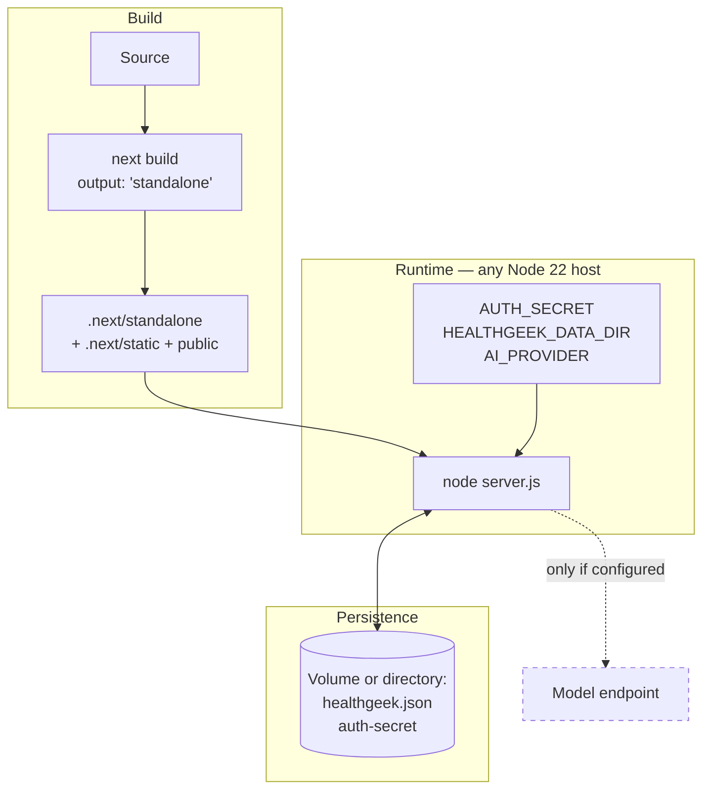
```mermaid
flowchart TB
    subgraph build ["Build"]
        src["Source"] --> nb["next build<br/>output: 'standalone'"]
        nb --> art[".next/standalone<br/>+ .next/static + public"]
    end

    subgraph run ["Runtime — any Node 22 host"]
        srv["node server.js"]
        env["AUTH_SECRET<br/>HEALTHGEEK_DATA_DIR<br/>AI_PROVIDER"]
    end

    subgraph persist ["Persistence"]
        vol[("Volume or directory:<br/>healthgeek.json<br/>auth-secret")]
    end

    art --> srv
    env --> srv
    srv <--> vol
    srv -.->|"only if configured"| model["Model endpoint"]

    style model stroke-dasharray: 5 5
```

The only stateful thing is the data directory. Back it up by copying one file; migrate by
moving it. There is nothing else to provision.

### Scaling shape

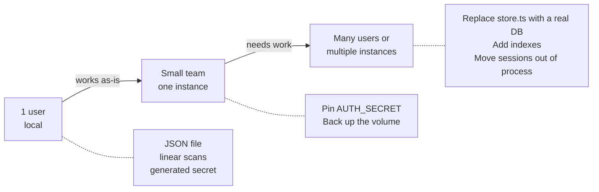
```mermaid
flowchart LR
    a["1 user<br/>local"] -->|works as-is| b["Small team<br/>one instance"]
    b -->|needs work| c["Many users or<br/>multiple instances"]

    a -.- an["JSON file<br/>linear scans<br/>generated secret"]
    b -.- bn["Pin AUTH_SECRET<br/>Back up the volume"]
    c -.- cn["Replace store.ts with a real DB<br/>Add indexes<br/>Move sessions out of process"]
```

A single process owns the file and serializes its own writes. Two instances pointed at the
same file would race — the in-process cache would go stale and the last writer would win.
That is the boundary where `store.ts` needs replacing, and it is deliberately the only
module that would have to change.

---

## Limits

What this design does not do:

| Limit | Consequence | When it matters |
|---|---|---|
| Single JSON file, whole-file rewrite per mutation | Write cost grows with total data size | Thousands of documents |
| No indexes — linear scans | Query cost grows with collection size | Thousands of documents |
| One writer process | Two instances on one file corrupt each other | Horizontal scaling |
| Credentials and health data in one file | A single file leak exposes both | Any shared deployment |
| Stateless session cookies | No server-side revocation; rotating `AUTH_SECRET` logs everyone out | Needing forced logout |
| No rate limiting on `/api/auth/login` | Online password guessing is unthrottled | Exposure beyond localhost |
| Hosted providers receive your data | Health photos and lab reports reach that vendor | Using a hosted `AI_PROVIDER` |

None of these are bugs in the local-first case the app targets. They are the terms of the
trade that makes it run with zero setup.
