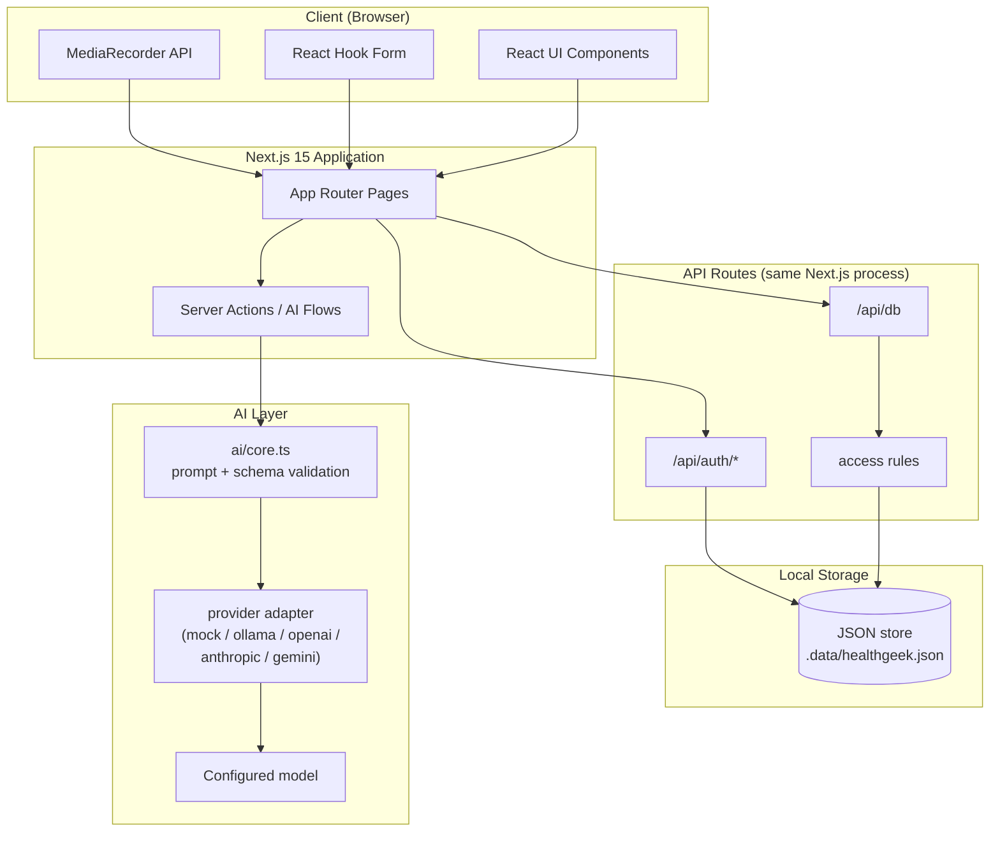
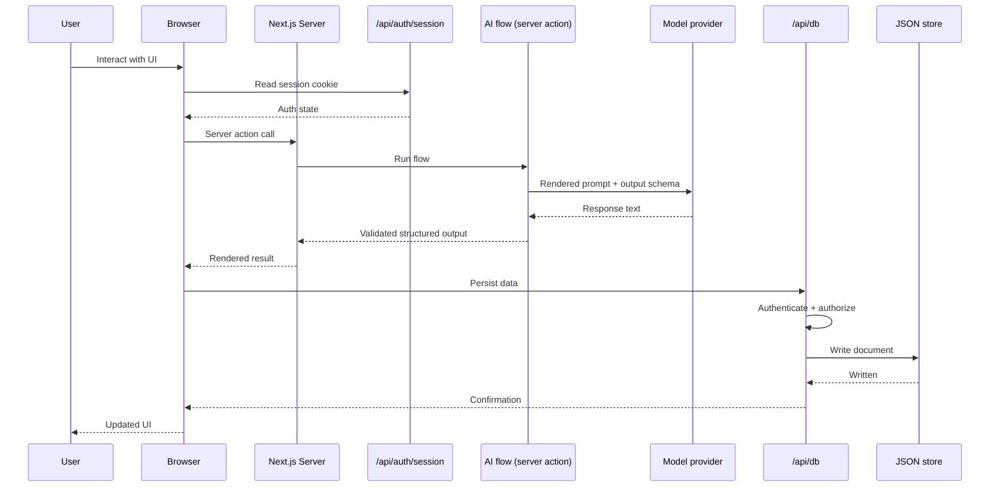
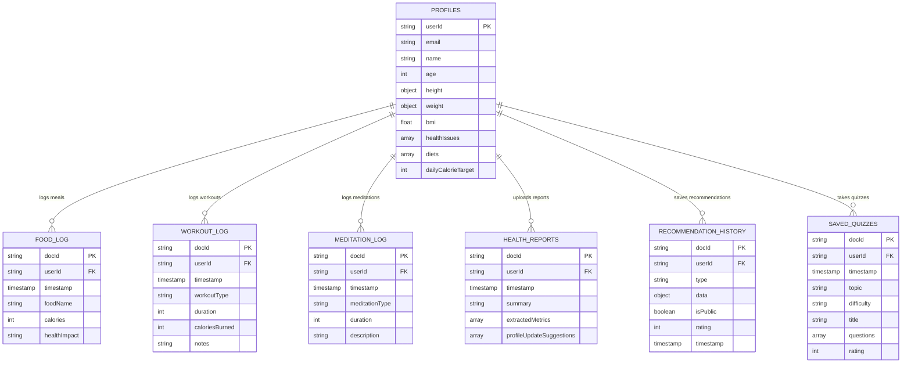
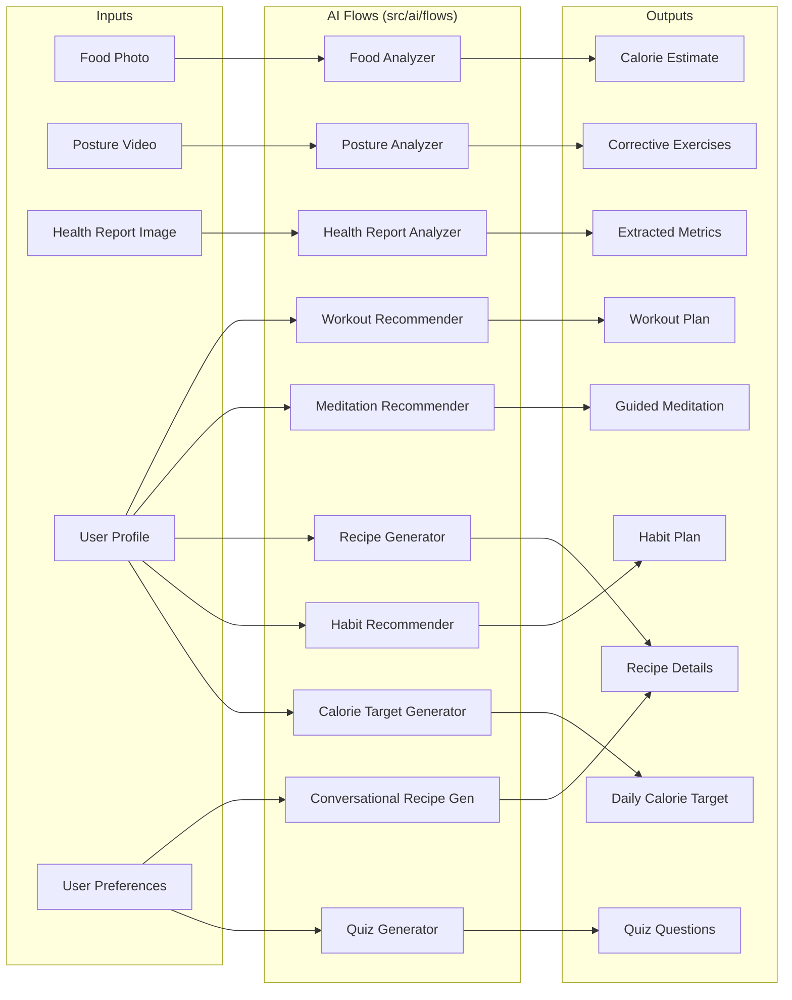
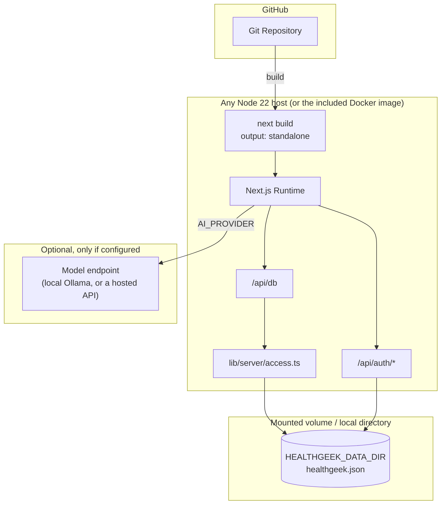
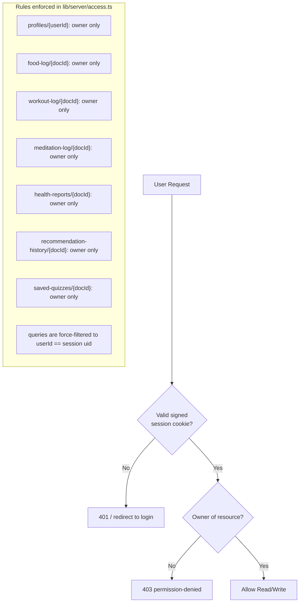
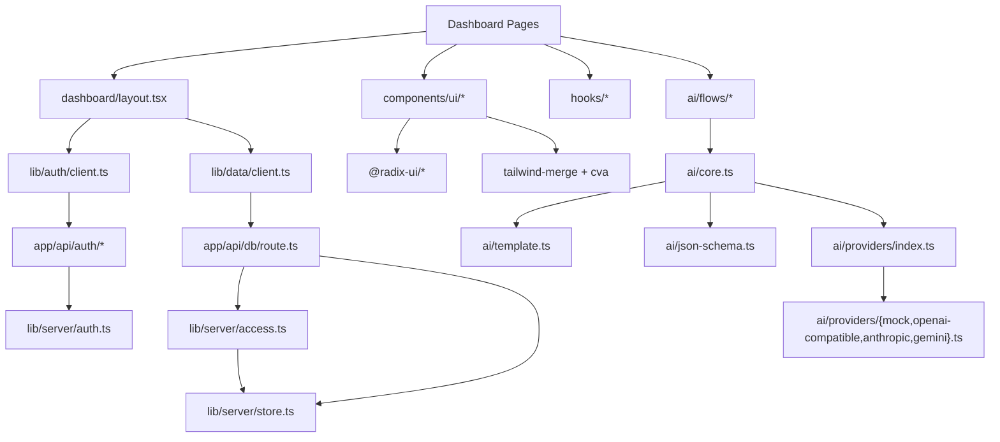

# Architecture

## System Overview

HealthGeek is a full-stack AI health platform built on Next.js. It has no cloud-provider
dependency: the document store is a JSON file on local disk, authentication is a signed
session cookie, and the AI layer is a set of interchangeable provider adapters.

```mermaid
graph TB
    subgraph Client ["Client (Browser)"]
        UI[React UI Components]
        RHF[React Hook Form]
        Media[MediaRecorder API]
    end

    subgraph NextJS ["Next.js 15 Application"]
        Pages[App Router Pages]
        ServerActions[Server Actions / AI Flows]
    end

    subgraph Routes ["API Routes (same Next.js process)"]
        AuthAPI["/api/auth/*"]
        DbAPI["/api/db"]
        Access["access rules"]
    end

    subgraph Storage ["Local Storage"]
        Store[("JSON store<br/>.data/healthgeek.json")]
    end

    subgraph AI ["AI Layer"]
        Core["ai/core.ts<br/>prompt + schema validation"]
        Providers["provider adapter<br/>(mock / ollama / openai /<br/>anthropic / gemini)"]
        Model[Configured model]
    end

    UI --> Pages
    RHF --> Pages
    Media --> Pages
    Pages --> ServerActions
    Pages --> AuthAPI
    Pages --> DbAPI
    DbAPI --> Access
    Access --> Store
    AuthAPI --> Store
    ServerActions --> Core
    Core --> Providers
    Providers --> Model
```

## Request Flow

```mermaid
sequenceDiagram
    participant U as User
    participant B as Browser
    participant N as Next.js Server
    participant A as /api/auth/session
    participant AI as AI flow (server action)
    participant P as Model provider
    participant D as /api/db
    participant F as JSON store

    U->>B: Interact with UI
    B->>A: Read session cookie
    A-->>B: Auth state
    B->>N: Server action call
    N->>AI: Run flow
    AI->>P: Rendered prompt + output schema
    P-->>AI: Response text
    AI-->>N: Validated structured output
    N-->>B: Rendered result
    B->>D: Persist data
    D->>D: Authenticate + authorize
    D->>F: Write document
    F-->>D: Written
    D-->>B: Confirmation
    B-->>U: Updated UI
```

## Data Architecture

```mermaid
erDiagram
    PROFILES {
        string userId PK
        string email
        string name
        int age
        object height
        object weight
        float bmi
        array healthIssues
        array diets
        int dailyCalorieTarget
    }

    FOOD_LOG {
        string docId PK
        string userId FK
        timestamp timestamp
        string foodName
        int calories
        string healthImpact
    }

    WORKOUT_LOG {
        string docId PK
        string userId FK
        timestamp timestamp
        string workoutType
        int duration
        int caloriesBurned
        string notes
    }

    MEDITATION_LOG {
        string docId PK
        string userId FK
        timestamp timestamp
        string meditationType
        int duration
        string description
    }

    HEALTH_REPORTS {
        string docId PK
        string userId FK
        timestamp timestamp
        string summary
        array extractedMetrics
        array profileUpdateSuggestions
    }

    RECOMMENDATION_HISTORY {
        string docId PK
        string userId FK
        string type
        object data
        boolean isPublic
        int rating
        timestamp timestamp
    }

    SAVED_QUIZZES {
        string docId PK
        string userId FK
        timestamp timestamp
        string topic
        string difficulty
        string title
        array questions
        int rating
    }

    PROFILES ||--o{ FOOD_LOG : "logs meals"
    PROFILES ||--o{ WORKOUT_LOG : "logs workouts"
    PROFILES ||--o{ MEDITATION_LOG : "logs meditations"
    PROFILES ||--o{ HEALTH_REPORTS : "uploads reports"
    PROFILES ||--o{ RECOMMENDATION_HISTORY : "saves recommendations"
    PROFILES ||--o{ SAVED_QUIZZES : "takes quizzes"
```

## AI Pipeline Architecture

```mermaid
graph LR
    subgraph Inputs
        Photo[Food Photo]
        Video[Posture Video]
        Report[Health Report Image]
        Profile[User Profile]
        Prefs[User Preferences]
    end

    subgraph Flows ["AI Flows (src/ai/flows)"]
        FA[Food Analyzer]
        HRA[Health Report Analyzer]
        PA[Posture Analyzer]
        WR[Workout Recommender]
        MR[Meditation Recommender]
        RG[Recipe Generator]
        CRG[Conversational Recipe Gen]
        HR[Habit Recommender]
        QG[Quiz Generator]
        CTG[Calorie Target Generator]
    end

    subgraph Outputs
        Calories[Calorie Estimate]
        Metrics[Extracted Metrics]
        Exercises[Corrective Exercises]
        Plan[Workout Plan]
        Guided[Guided Meditation]
        Recipe[Recipe Details]
        Habits[Habit Plan]
        Quiz[Quiz Questions]
        Target[Daily Calorie Target]
    end

    Photo --> FA --> Calories
    Report --> HRA --> Metrics
    Video --> PA --> Exercises
    Profile --> WR --> Plan
    Profile --> MR --> Guided
    Profile --> RG --> Recipe
    Prefs --> CRG --> Recipe
    Profile --> HR --> Habits
    Prefs --> QG --> Quiz
    Profile --> CTG --> Target
```

## Deployment Architecture

```mermaid
graph TB
    subgraph GitHub
        Repo[Git Repository]
    end

    subgraph Host ["Any Node 22 host (or the included Docker image)"]
        Build["next build<br/>output: standalone"]
        Runtime[Next.js Runtime]
        AuthRoutes["/api/auth/*"]
        DbRoute["/api/db"]
        AccessRules["lib/server/access.ts"]
    end

    subgraph Disk ["Mounted volume / local directory"]
        StoreFile[("HEALTHGEEK_DATA_DIR<br/>healthgeek.json")]
    end

    subgraph External ["Optional, only if configured"]
        Provider["Model endpoint<br/>(local Ollama, or a hosted API)"]
    end

    Repo -->|build| Build
    Build --> Runtime
    Runtime --> AuthRoutes
    Runtime --> DbRoute
    DbRoute --> AccessRules
    AccessRules --> StoreFile
    AuthRoutes --> StoreFile
    Runtime -->|AI_PROVIDER| Provider
```

## Security Model

```mermaid
graph TD
    User[User Request] --> Cookie{Valid signed<br/>session cookie?}
    Cookie -->|No| Login[401 / redirect to login]
    Cookie -->|Yes| OwnerCheck{Owner of resource?}
    OwnerCheck -->|No| Deny[403 permission-denied]
    OwnerCheck -->|Yes| Allow[Allow Read/Write]

    subgraph Rules ["Rules enforced in lib/server/access.ts"]
        R1["profiles/{userId}: owner only"]
        R2["food-log/{docId}: owner only"]
        R3["workout-log/{docId}: owner only"]
        R4["meditation-log/{docId}: owner only"]
        R5["health-reports/{docId}: owner only"]
        R6["recommendation-history/{docId}: owner only"]
        R7["saved-quizzes/{docId}: owner only"]
        R8["queries are force-filtered to userId == session uid"]
    end
```

Because the browser cannot reach the store directly, these checks run on every
`/api/db` request before any document is read or written. A client that forges a
`where('userId', '==', someoneElse)` filter has it replaced with its own uid.

## Module Dependency Graph

```mermaid
graph TD
    Layout["dashboard/layout.tsx"] --> Auth["lib/auth/client.ts"]
    Layout --> DB["lib/data/client.ts"]

    Pages["Dashboard Pages"] --> Layout
    Pages --> UIComponents["components/ui/*"]
    Pages --> Hooks["hooks/*"]
    Pages --> AIFlows["ai/flows/*"]

    Auth --> AuthRoutes["app/api/auth/*"]
    DB --> DbRoute["app/api/db/route.ts"]
    AuthRoutes --> ServerAuth["lib/server/auth.ts"]
    DbRoute --> AccessRules["lib/server/access.ts"]
    DbRoute --> Store["lib/server/store.ts"]
    AccessRules --> Store

    AIFlows --> AiCore["ai/core.ts"]
    AiCore --> Template["ai/template.ts"]
    AiCore --> Schema["ai/json-schema.ts"]
    AiCore --> ProviderRegistry["ai/providers/index.ts"]
    ProviderRegistry --> Adapters["ai/providers/{mock,openai-compatible,anthropic,gemini}.ts"]

    UIComponents --> Radix["@radix-ui/*"]
    UIComponents --> Tailwind["tailwind-merge + cva"]
```
