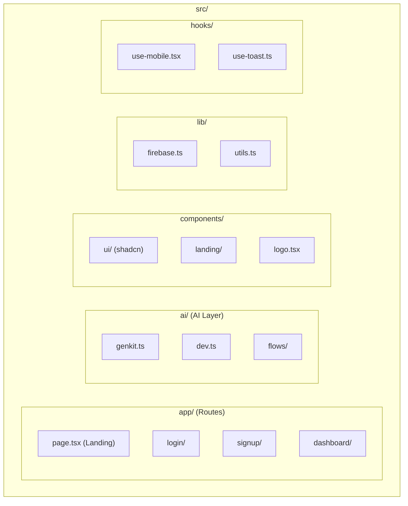
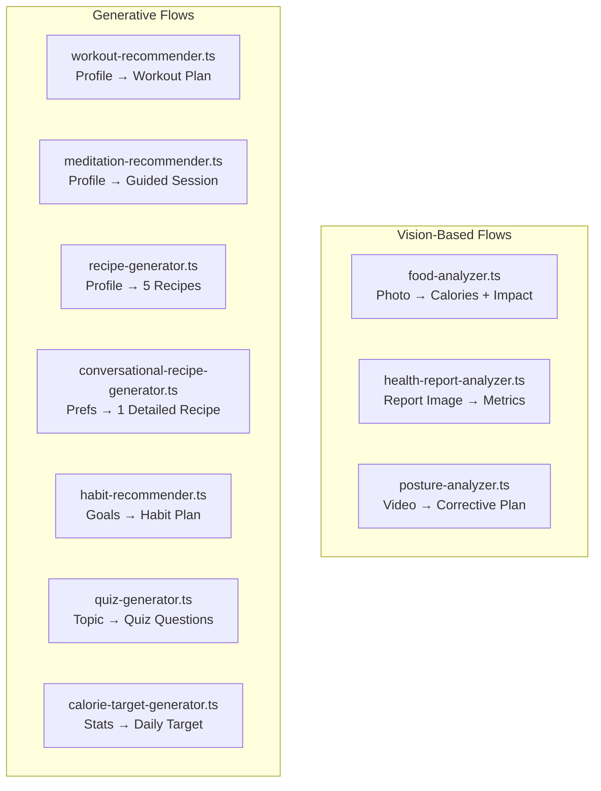
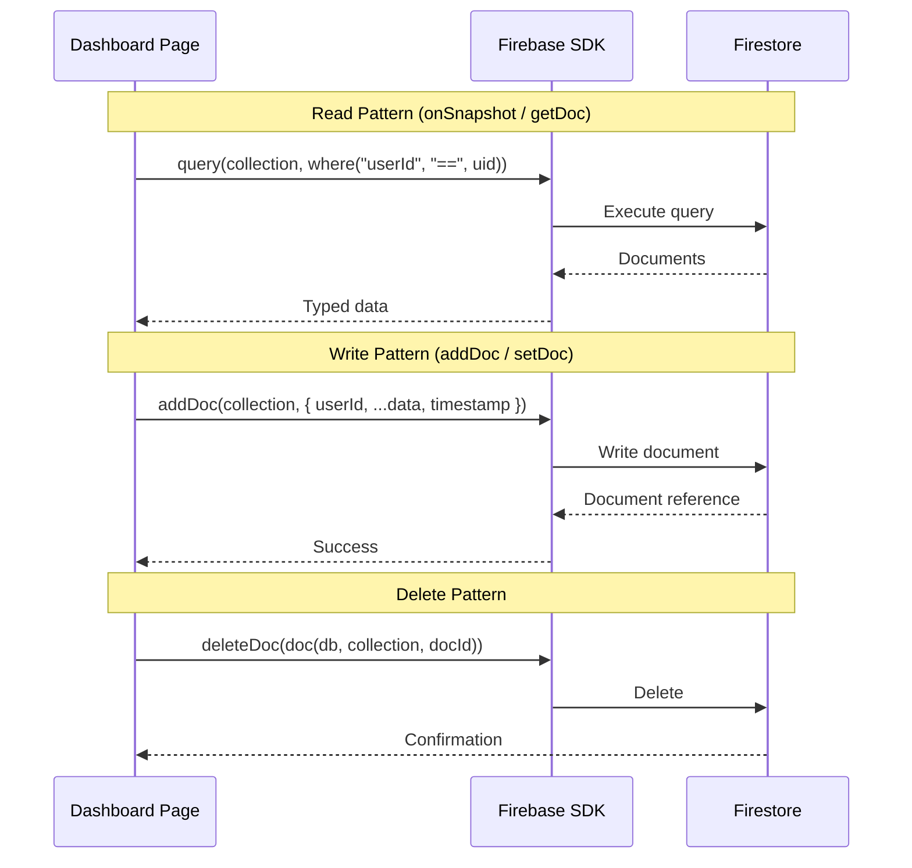
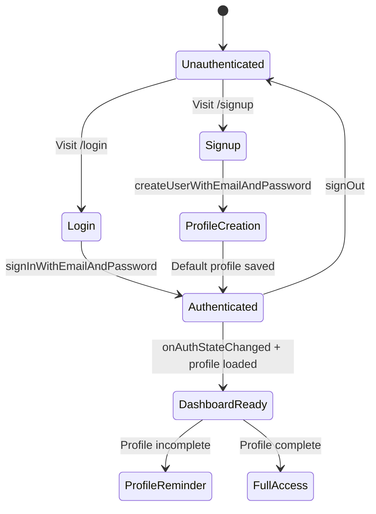

# Code Documentation

## Project Structure



## AI Flows Reference

All AI flows live in `src/ai/flows/` and use the shared Genkit instance from `src/ai/genkit.ts`.

### Flow Catalog



### Flow Input/Output Contracts

#### food-analyzer.ts
```typescript
Input: {
  photoUrl: string;       // data URI of food image
  profile: string;        // JSON stringified user profile
  healthReport?: string;  // optional health report context
}
Output: {
  foodName: string;
  calories: number;
  healthImpact: string;
}
```

#### health-report-analyzer.ts
```typescript
Input: {
  reportImage: string;    // data URI of health report
  profile: string;        // JSON stringified user profile
}
Output: {
  summary: string;
  extractedMetrics: Array<{name, value, unit, interpretation}>;
  profileUpdateSuggestions: Array<{field, value, reason}>;
}
```

#### workout-recommender.ts
```typescript
Input: {
  profile: string;
  healthReport?: string;
  duration: number;       // minutes
  location: string;       // "home" | "gym"
  focusAreas: string[];
}
Output: {
  planTitle: string;
  planSummary: string;
  warmUp: Array<{exercise, duration, instructions}>;
  mainWorkout: Array<{exercise, sets, reps, duration, instructions}>;
  coolDown: Array<{exercise, duration, instructions}>;
  notes: string;
  tags: string[];
}
```

#### meditation-recommender.ts
```typescript
Input: {
  profile: string;
  duration: number;
  timeOfDay: string;
  goals: string[];
  customInstructions?: string;
}
Output: {
  title: string;
  summary: string;
  steps: Array<{instruction, duration}>;
  benefits: string;
  tags: string[];
}
```

#### conversational-recipe-generator.ts
```typescript
Input: {
  profile: string;
  mealType: string;
  cuisine: string;
  includeIngredients: string[];
  excludeIngredients: string[];
  dietaryNotes: string;
}
Output: {
  name: string;
  description: string;
  ingredients: Array<{item, amount}>;
  instructions: string[];
  healthFocus: string;
  prepTime: string;
  cookTime: string;
  servings: number;
  tags: string[];
}
```

#### habit-recommender.ts
```typescript
Input: {
  profile: string;
  goals: string[];
  customInstructions?: string;
}
Output: {
  planTitle: string;
  summary: string;
  habits: Array<{name, description, frequency, tip}>;
  benefits: string;
  tags: string[];
}
```

#### quiz-generator.ts
```typescript
Input: {
  topic: string;
  difficulty: "easy" | "medium" | "hard";
  questionCount: number;
}
Output: {
  title: string;
  questions: Array<{
    question: string;
    options: [string, string, string, string];
    correctAnswerIndex: number;
    explanation: string;
  }>;
}
```

#### calorie-target-generator.ts
```typescript
Input: {
  age: number;
  bmi: number;
  currentWeight: number;
  targetWeight: number;
  healthIssues: string[];
  diets: string[];
}
Output: {
  dailyCalorieTarget: number;
}
```

## Firestore Data Access Patterns



### Collection Query Index Requirements

| Collection | Query Pattern | Index |
|-----------|--------------|-------|
| `food-log` | userId + timestamp ASC | Composite |
| `workout-log` | userId + timestamp DESC | Composite |
| `workout-log` | userId + workoutType ASC | Composite |
| `meditation-log` | userId + timestamp DESC | Composite |
| `meditation-log` | userId + meditationType ASC | Composite |
| `saved-quizzes` | userId + timestamp DESC | Composite |

## Authentication Flow



## Conventions

- **Path alias**: `@/` maps to `src/`
- **Client components**: Explicitly marked with `'use client'` directive
- **AI flows**: Each flow is a self-contained file with Zod schema validation
- **State management**: React hooks + Firebase listeners (no external state library)
- **Form handling**: React Hook Form with Zod resolvers for validation
- **Styling**: Tailwind utility classes, `cn()` helper for conditional merging
- **Icons**: Lucide React exclusively
- **Date handling**: `date-fns` library
- **PDF export**: jsPDF with autotable plugin for tabular reports

## Environment Variables

| Variable | Purpose |
|----------|---------|
| `NEXT_PUBLIC_FIREBASE_API_KEY` | Firebase client API key |
| `NEXT_PUBLIC_FIREBASE_AUTH_DOMAIN` | Firebase auth domain |
| `NEXT_PUBLIC_FIREBASE_PROJECT_ID` | Firebase project ID |
| `NEXT_PUBLIC_FIREBASE_STORAGE_BUCKET` | Firebase storage bucket |
| `NEXT_PUBLIC_FIREBASE_MESSAGING_SENDER_ID` | FCM sender ID |
| `NEXT_PUBLIC_FIREBASE_APP_ID` | Firebase app ID |
| `NEXT_PUBLIC_FIREBASE_MEASUREMENT_ID` | Google Analytics measurement ID |
| `GOOGLE_API_KEY` | Google AI (Gemini) API key for Genkit |
