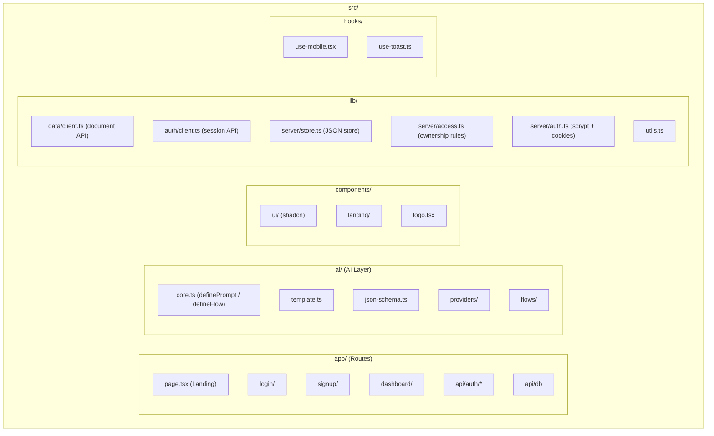
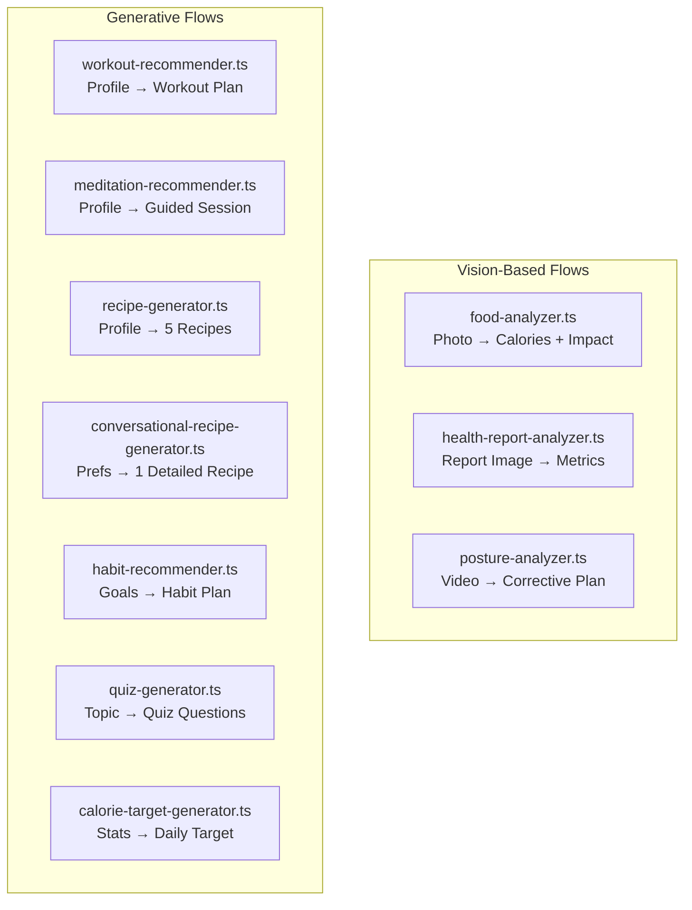
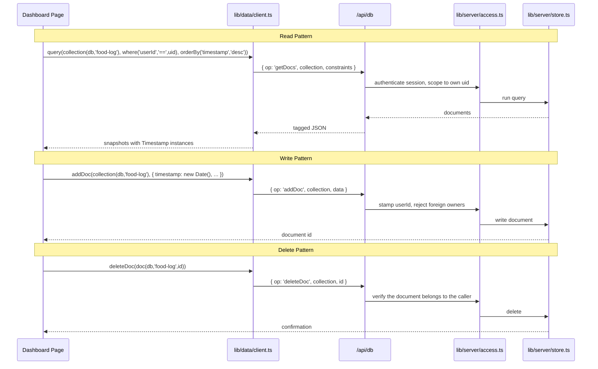
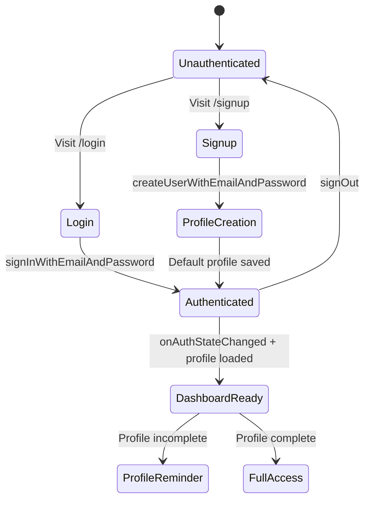

# Code Documentation

## Project Structure


```mermaid
graph TD
    subgraph src ["src/"]
        subgraph app ["app/ (Routes)"]
            Landing["page.tsx (Landing)"]
            LoginPage["login/"]
            SignupPage["signup/"]
            Dashboard["dashboard/"]
            ApiAuth["api/auth/*"]
            ApiDb["api/db"]
        end

        subgraph ai ["ai/ (AI Layer)"]
            Core["core.ts (definePrompt / defineFlow)"]
            Template["template.ts"]
            SchemaGen["json-schema.ts"]
            ProviderDir["providers/"]
            Flows["flows/"]
        end

        subgraph components ["components/"]
            UILib["ui/ (shadcn)"]
            LandingComps["landing/"]
            LogoComp["logo.tsx"]
        end

        subgraph lib ["lib/"]
            DataClient["data/client.ts (document API)"]
            AuthClient["auth/client.ts (session API)"]
            ServerStore["server/store.ts (JSON store)"]
            ServerAccess["server/access.ts (ownership rules)"]
            ServerAuth["server/auth.ts (scrypt + cookies)"]
            Utils["utils.ts"]
        end

        subgraph hooks ["hooks/"]
            UseMobile["use-mobile.tsx"]
            UseToast["use-toast.ts"]
        end
    end
```

## AI Flows Reference

All AI flows live in `src/ai/flows/` and use the shared runtime from `src/ai/core.ts`.
Each flow declares Zod input/output schemas and a prompt template; `core.ts` renders the
template, calls whichever provider `AI_PROVIDER` selects, and validates the response
against the output schema (retrying once with the validation error if it does not match).

### Flow Catalog


```mermaid
graph TD
    subgraph Vision ["Vision-Based Flows"]
        FA["food-analyzer.ts<br/>Photo → Calories + Impact"]
        HRA["health-report-analyzer.ts<br/>Report Image → Metrics"]
        PA["posture-analyzer.ts<br/>Video → Corrective Plan"]
    end

    subgraph Generative ["Generative Flows"]
        WR["workout-recommender.ts<br/>Profile → Workout Plan"]
        MR["meditation-recommender.ts<br/>Profile → Guided Session"]
        RG["recipe-generator.ts<br/>Profile → 5 Recipes"]
        CRG["conversational-recipe-generator.ts<br/>Prefs → 1 Detailed Recipe"]
        HR["habit-recommender.ts<br/>Goals → Habit Plan"]
        QG["quiz-generator.ts<br/>Topic → Quiz Questions"]
        CTG["calorie-target-generator.ts<br/>Stats → Daily Target"]
    end
```

### Flow Input/Output Contracts

#### food-analyzer.ts
```typescript
Input: {
  photoUrl: string;       // data URI of food image
  profile: string;        // JSON stringified user profile
  healthReport?: string;  // optional health report context
}
Output: {
  foodName: string;
  calories: number;
  healthImpact: string;
}
```

#### health-report-analyzer.ts
```typescript
Input: {
  reportImage: string;    // data URI of health report
  profile: string;        // JSON stringified user profile
}
Output: {
  summary: string;
  extractedMetrics: Array<{name, value, unit, interpretation}>;
  profileUpdateSuggestions: Array<{field, value, reason}>;
}
```

#### workout-recommender.ts
```typescript
Input: {
  profile: string;
  healthReport?: string;
  duration: number;       // minutes
  location: string;       // "home" | "gym"
  focusAreas: string[];
}
Output: {
  planTitle: string;
  planSummary: string;
  warmUp: Array<{exercise, duration, instructions}>;
  mainWorkout: Array<{exercise, sets, reps, duration, instructions}>;
  coolDown: Array<{exercise, duration, instructions}>;
  notes: string;
  tags: string[];
}
```

#### meditation-recommender.ts
```typescript
Input: {
  profile: string;
  duration: number;
  timeOfDay: string;
  goals: string[];
  customInstructions?: string;
}
Output: {
  title: string;
  summary: string;
  steps: Array<{instruction, duration}>;
  benefits: string;
  tags: string[];
}
```

#### conversational-recipe-generator.ts
```typescript
Input: {
  profile: string;
  mealType: string;
  cuisine: string;
  includeIngredients: string[];
  excludeIngredients: string[];
  dietaryNotes: string;
}
Output: {
  name: string;
  description: string;
  ingredients: Array<{item, amount}>;
  instructions: string[];
  healthFocus: string;
  prepTime: string;
  cookTime: string;
  servings: number;
  tags: string[];
}
```

#### habit-recommender.ts
```typescript
Input: {
  profile: string;
  goals: string[];
  customInstructions?: string;
}
Output: {
  planTitle: string;
  summary: string;
  habits: Array<{name, description, frequency, tip}>;
  benefits: string;
  tags: string[];
}
```

#### quiz-generator.ts
```typescript
Input: {
  topic: string;
  difficulty: "easy" | "medium" | "hard";
  questionCount: number;
}
Output: {
  title: string;
  questions: Array<{
    question: string;
    options: [string, string, string, string];
    correctAnswerIndex: number;
    explanation: string;
  }>;
}
```

#### calorie-target-generator.ts
```typescript
Input: {
  age: number;
  bmi: number;
  currentWeight: number;
  targetWeight: number;
  healthIssues: string[];
  diets: string[];
}
Output: {
  dailyCalorieTarget: number;
}
```

## Data Access Patterns

Pages import `collection`, `doc`, `query`, `where`, `orderBy`, `limit`, `startAt`, `endAt`,
`getDoc`, `getDocs`, `setDoc`, `addDoc`, `updateDoc`, `deleteDoc`, `Timestamp`, and
`serverTimestamp` from `@/lib/data/client`. Each call becomes one `POST /api/db`.


```mermaid
sequenceDiagram
    participant Page as Dashboard Page
    participant C as lib/data/client.ts
    participant R as /api/db
    participant A as lib/server/access.ts
    participant S as lib/server/store.ts

    Note over Page,S: Read Pattern
    Page->>C: query(collection(db,'food-log'), where('userId','==',uid), orderBy('timestamp','desc'))
    C->>R: { op: 'getDocs', collection, constraints }
    R->>A: authenticate session, scope to own uid
    A->>S: run query
    S-->>R: documents
    R-->>C: tagged JSON
    C-->>Page: snapshots with Timestamp instances

    Note over Page,S: Write Pattern
    Page->>C: addDoc(collection(db,'food-log'), { timestamp: new Date(), ... })
    C->>R: { op: 'addDoc', collection, data }
    R->>A: stamp userId, reject foreign owners
    A->>S: write document
    S-->>Page: document id

    Note over Page,S: Delete Pattern
    Page->>C: deleteDoc(doc(db,'food-log',id))
    C->>R: { op: 'deleteDoc', collection, id }
    R->>A: verify the document belongs to the caller
    A->>S: delete
    S-->>Page: confirmation
```

### Supported query constraints

| Constraint | Notes |
|-----------|-------|
| `where(field, op, value)` | `==`, `!=`, `<`, `<=`, `>`, `>=`, `in`, `not-in`, `array-contains` |
| `orderBy(field, direction)` | Multiple sort fields applied in order |
| `limit(count)` | Applied last |
| `startAt(value)` / `endAt(value)` | Inclusive bounds on the first sort field; `endAt(text + '\uf8ff')` gives prefix search |

No index declarations are needed — the store evaluates queries in process. That also means
query cost is linear in collection size, which is fine at single-user scale.

### Timestamps

`Timestamp` and `serverTimestamp()` come from `@/lib/data/client`. Values are tagged on the
wire by `lib/data/wire.ts`, so a `Date` or `Timestamp` written to a document comes back as a
`Timestamp` with `.toDate()`, and `serverTimestamp()` is resolved by the server's clock.

## Authentication Flow


```mermaid
stateDiagram-v2
    [*] --> Unauthenticated
    Unauthenticated --> Login: Visit /login
    Unauthenticated --> Signup: Visit /signup

    Login --> Authenticated: signInWithEmailAndPassword
    Signup --> ProfileCreation: createUserWithEmailAndPassword
    ProfileCreation --> Authenticated: Default profile saved

    Authenticated --> DashboardReady: onAuthStateChanged + profile loaded
    DashboardReady --> ProfileReminder: Profile incomplete
    DashboardReady --> FullAccess: Profile complete

    Authenticated --> Unauthenticated: signOut
```

## Conventions

- **Path alias**: `@/` maps to `src/`
- **Client components**: Explicitly marked with `'use client'` directive
- **AI flows**: Each flow is a self-contained file with Zod schema validation
- **State management**: React hooks + the auth client's subscription (no external state library)
- **Form handling**: React Hook Form with Zod resolvers for validation
- **Styling**: Tailwind utility classes, `cn()` helper for conditional merging
- **Icons**: Lucide React exclusively
- **Date handling**: `date-fns` library
- **PDF export**: jsPDF with autotable plugin for tabular reports

## Environment Variables

| Variable | Purpose |
|----------|---------|
| `AUTH_SECRET` | Signs session cookies; optional, auto-generated into the data directory if unset |
| `HEALTHGEEK_DATA_DIR` | Directory holding `healthgeek.json` (default `./.data`) |
| `AI_PROVIDER` | `mock`, `ollama`, `openai`, `anthropic`, or `gemini` (default `mock`) |
| `AI_MODEL` | Model name; each provider has a default |
| `AI_API_KEY` | Credential for the chosen provider |
| `AI_BASE_URL` | Override the provider endpoint |
| `AI_MAX_TOKENS` | Response cap for the `anthropic` provider |

None are required to run: with an empty `.env.local` the app uses the local store and the
`mock` AI provider.
