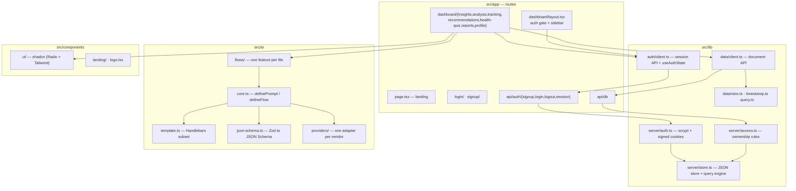
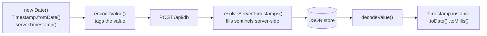
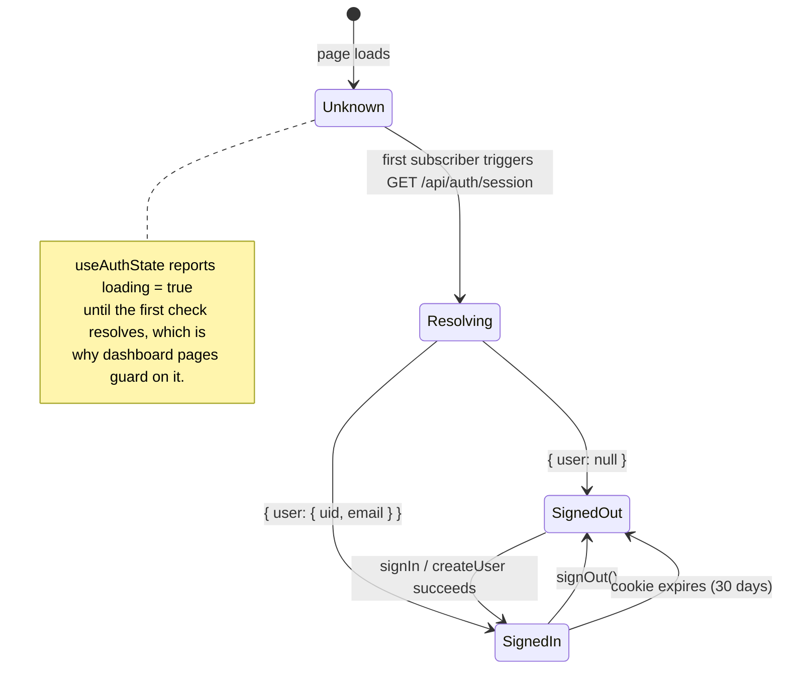
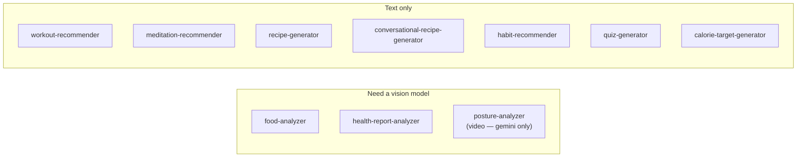
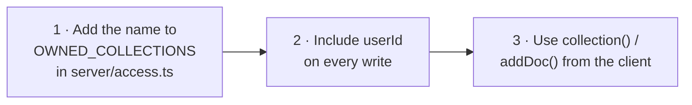

# Code Guide

Where things live, what the two internal APIs look like, and how to extend them.

---

## Module map


```mermaid
flowchart TB
    subgraph app ["src/app — routes"]
        landing["page.tsx — landing"]
        login["login/ · signup/"]
        dash["dashboard/layout.tsx<br/>auth gate + sidebar"]
        pages["dashboard/{insights,analysis,tracking,<br/>recommendations,health-quiz,reports,profile}"]
        apiAuth["api/auth/{signup,login,logout,session}"]
        apiDb["api/db"]
    end

    subgraph lib ["src/lib"]
        dataClient["data/client.ts — document API"]
        dataWire["data/wire.ts · timestamp.ts · query.ts"]
        authClient["auth/client.ts — session API + useAuthState"]
        srvStore["server/store.ts — JSON store + query engine"]
        srvAccess["server/access.ts — ownership rules"]
        srvAuth["server/auth.ts — scrypt + signed cookies"]
    end

    subgraph ai ["src/ai"]
        core["core.ts — definePrompt / defineFlow"]
        tpl["template.ts — Handlebars subset"]
        js["json-schema.ts — Zod to JSON Schema"]
        prov["providers/ — one adapter per vendor"]
        flows["flows/ — one feature per file"]
    end

    subgraph ui ["src/components"]
        shad["ui/ — shadcn (Radix + Tailwind)"]
        land["landing/ · logo.tsx"]
    end

    dash --> authClient
    pages --> dataClient
    pages --> authClient
    pages --> flows
    pages --> shad
    dataClient --> dataWire
    dataClient --> apiDb
    authClient --> apiAuth
    apiDb --> srvAccess --> srvStore
    apiAuth --> srvAuth --> srvStore
    flows --> core
    core --> tpl
    core --> js
    core --> prov
```

**The rule that keeps this honest:** nothing under `src/lib/server/` may be imported by a
client component. Those modules use `node:fs` and `node:crypto` and read the session cookie.
Client code reaches them only through the two API routes.

---

## Data API

`src/lib/data/client.ts` is what pages import. The surface mirrors Firestore's, so page
code reads the way it always did, but every call is one `POST /api/db`.

```typescript
import {
  db, collection, doc, query,
  where, orderBy, limit, startAt, endAt,
  getDoc, getDocs, setDoc, addDoc, updateDoc, deleteDoc,
  Timestamp, serverTimestamp,
} from '@/lib/data/client';
```

### Reading

```typescript
// One document
const snap = await getDoc(doc(db, 'profiles', user.uid));
if (snap.exists()) setProfile(snap.data());

// A filtered, sorted query
const q = query(
  collection(db, 'food-log'),
  where('timestamp', '>=', Timestamp.fromDate(startOfDay)),
  where('timestamp', '<',  Timestamp.fromDate(nextDay)),
  orderBy('timestamp', 'desc'),
  limit(10),
);
const results = await getDocs(q);
results.docs.map(d => ({ id: d.id, ...d.data(), timestamp: d.data().timestamp.toDate() }));
results.size;   // count
results.empty;  // boolean
```

You never write `where('userId','==',user.uid)` for correctness — the server adds it
regardless. Existing call sites that include it still work; the clause is stripped and
replaced.

### Writing

```typescript
await addDoc(collection(db, 'workout-log'), {
  timestamp: serverTimestamp(),   // or new Date(), or Timestamp.now()
  workoutType: 'Running',
  duration: 30,
});                                // userId is stamped server-side

await setDoc(doc(db, 'profiles', user.uid), profile);              // replace
await setDoc(doc(db, 'profiles', user.uid), patch, { merge: true }); // merge
await updateDoc(doc(db, 'saved-quizzes', id), { rating: 4 });
await deleteDoc(doc(db, 'food-log', id));
```

### Query constraints

| Constraint | Notes |
|---|---|
| `where(field, op, value)` | `==`, `!=`, `<`, `<=`, `>`, `>=`, `in`, `not-in`, `array-contains`. Dotted paths work. |
| `orderBy(field, direction)` | Multiple sort fields applied in declaration order |
| `limit(count)` | Applied last |
| `startAt(value)` / `endAt(value)` | Inclusive bounds on the **first** sort field |

Prefix search is `orderBy` plus a cursor pair:

```typescript
query(collection(db, 'food-log'),
  orderBy('foodName'),
  startAt(text),
  endAt(text + ''));   // U+F8FF sorts above ordinary characters
```

No index declarations are needed — queries are evaluated in process, so cost is linear in
collection size.

### Timestamps


```mermaid
flowchart LR
    a["new Date()<br/>Timestamp.fromDate()<br/>serverTimestamp()"] --> b["encodeValue()<br/>tags the value"]
    b --> c["POST /api/db"]
    c --> d["resolveServerTimestamps()<br/>fills sentinels server-side"]
    d --> e[("JSON store")]
    e --> f["decodeValue()"]
    f --> g["Timestamp instance<br/>.toDate() .toMillis()"]
```

Anything date-shaped comes back as a `Timestamp`, so `.toDate()` is always available.
`undefined` fields are dropped on write, matching Firestore's `ignoreUndefinedProperties`.

### Errors

Failures throw `DataStoreError` with a `.code` and a human-readable `.message`:

| `code` | HTTP | Meaning |
|---|---|---|
| `unauthenticated` | 401 | No valid session cookie |
| `permission-denied` | 403 | Not your document, or not a queryable collection |
| `not-found` | 404 | `updateDoc` on a missing document |
| `invalid-argument` | 400 | Unknown collection, or a malformed request |
| `unavailable` | — | The fetch itself failed — server down |

---

## Auth API

`src/lib/auth/client.ts` replaces Firebase Auth with the same call shapes.

```typescript
import {
  auth, useAuthState, onAuthStateChanged,
  signInWithEmailAndPassword, createUserWithEmailAndPassword, signOut,
} from '@/lib/auth/client';

const [user, loading] = useAuthState(auth);   // user: { uid, email } | null
```


```mermaid
stateDiagram-v2
    [*] --> Unknown: page loads
    Unknown --> Resolving: first subscriber triggers GET /api/auth/session
    Resolving --> SignedOut: { user: null }
    Resolving --> SignedIn: { user: { uid, email } }
    SignedOut --> SignedIn: signIn / createUser succeeds
    SignedIn --> SignedOut: signOut()
    SignedIn --> SignedOut: cookie expires (30 days)

    note right of Unknown
        useAuthState reports loading = true
        until the first check resolves, which is
        why dashboard pages guard on it.
    end note
```

One in-flight session request is shared across all subscribers, so ten components calling
`useAuthState` produce one network call. State changes fan out to every subscriber.

`src/app/dashboard/layout.tsx` is the gate: it subscribes, redirects to `/login` when the
user is null, and creates a blank profile on first sign-in.

---

## AI flows

Each file in `src/ai/flows/` is a `'use server'` module exporting one async function. Pages
call it directly as a server action.


```mermaid
flowchart LR
    subgraph vision ["Need a vision model"]
        fa["food-analyzer"]
        hra["health-report-analyzer"]
        pa["posture-analyzer<br/>(video — gemini only)"]
    end
    subgraph text ["Text only"]
        wr["workout-recommender"]
        mr["meditation-recommender"]
        rg["recipe-generator"]
        crg["conversational-recipe-generator"]
        hr["habit-recommender"]
        qg["quiz-generator"]
        ctg["calorie-target-generator"]
    end
```

### Catalog

| File | Export | Input | Output |
|---|---|---|---|
| `food-analyzer.ts` | `analyzeFood` | `photoDataUri`, `userProfile`, `latestHealthReport?` | `foodName`, `calories`, `healthImpact` |
| `health-report-analyzer.ts` | `analyzeHealthReport` | `reportPhotoDataUri`, `existingProfile` | `summary`, `extractedMetrics[]`, `profileUpdateSuggestions` |
| `posture-analyzer.ts` | `analyzePosture` | `videoDataUri`, `question`, `userProfile` | `analysis`, `recommendations[]` |
| `workout-recommender.ts` | `generateWorkoutPlan` | `userProfile`, `latestHealthReport?`, `workoutDuration`, `location` (`home`\|`gym`), `focusAreas[]` | `planTitle`, `planSummary`, `warmUp[]`, `mainWorkout[]`, `coolDown[]`, `notes`, `tags[]` |
| `meditation-recommender.ts` | `generateMeditationPractice` | `userProfile`, `duration`, `timeOfDay` (`morning`\|`afternoon`\|`evening`), `goals[]`, `customInstructions?` | `title`, `summary`, `steps[]`, `benefits`, `tags[]` |
| `recipe-generator.ts` | `generateRecipes` | `userProfile`, `latestHealthReport?` | `recipes[]` |
| `conversational-recipe-generator.ts` | `generateSingleRecipe` | `mealType`, `cuisine`, `ingredientsToInclude?`, `ingredientsToExclude?`, `dietaryNotes?`, `userProfile` | `name`, `description`, `ingredients[]`, `instructions[]`, `healthFocus`, `prepTime`, `cookTime`, `servings`, `tags[]` |
| `habit-recommender.ts` | `generateHabitPlan` | `userProfile`, `goals[]`, `customInstructions?` | `planTitle`, `summary`, `habits[]`, `benefits`, `tags[]` |
| `quiz-generator.ts` | `generateQuiz` | `topic`, `difficulty` (`easy`\|`medium`\|`hard`), `numberOfQuestions` (3–15) | `title`, `questions[]` |
| `calorie-target-generator.ts` | `generateCalorieTarget` | `age`, `bmi`, `currentWeight`, `targetWeight`, `weightUnit`, `healthIssues[]`, `diets[]` | `dailyCalorieTarget` |

`userProfile` and `latestHealthReport` are **JSON strings**, not objects — call sites pass
`JSON.stringify(profile)`.

> `food-assessor.ts` and `dashboard/food-assessment/page.tsx` are empty stubs from an
> unfinished feature. That route renders nothing.

### Anatomy of a flow

```typescript
const InputSchema  = z.object({ topic: z.string().describe('The health topic.') });
const OutputSchema = z.object({ title: z.string().describe('A short, catchy title.') });

const prompt = ai.definePrompt({
  name: 'quizGeneratorPrompt',
  input:  { schema: InputSchema },
  output: { schema: OutputSchema },
  prompt: `You are a health educator.

Topic: {{{topic}}}`,
});

const flow = ai.defineFlow(
  { name: 'quizGeneratorFlow', inputSchema: InputSchema, outputSchema: OutputSchema },
  async input => (await prompt(input)).output!,
);
```

`.describe()` is not decoration — it becomes the field description in the JSON Schema sent
to the model, and it is the main lever for steering output quality.

---

## Extension recipes

### Add a collection


```mermaid
flowchart LR
    a["1 · Add the name to<br/>OWNED_COLLECTIONS<br/>in server/access.ts"] --> b["2 · Include userId<br/>on every write"]
    b --> c["3 · Use collection() /<br/>addDoc() from the client"]
```

Step 1 is not optional — `/api/db` rejects unknown collections with `400 invalid-argument`.
Anything in `OWNED_COLLECTIONS` automatically gets uid stamping on write and forced
scoping on read.

### Add an AI provider

1. Create `src/ai/providers/<vendor>.ts` exporting a factory that returns a `ModelProvider`
   (`{ id, model, generate(request) }`).
2. In `generate`, turn `request.parts` into that vendor's content shape. Use `parseDataUri`
   and `isImage` from `providers/types.ts`; push an explicit "could not read this
   attachment" note for media you cannot send.
3. Append `jsonInstruction(request.outputSchema)` to the system prompt when a schema is
   present, and set native JSON mode if the vendor has one.
4. Register it in `providers/index.ts`: add the id to `DEFAULT_MODELS` and a `case` in
   `build()`.

Return the raw response text. Parsing, validation and retry are `core.ts`'s job.

### Add a flow

Copy the anatomy above into a new file under `src/ai/flows/`, keep the `'use server'`
directive, and import it from a page. Nothing needs registering — flows are ordinary
modules.

### Add a page

Create `src/app/dashboard/<name>/page.tsx` with `'use client'`, and add a `<Link>` to the
sidebar in `dashboard/layout.tsx`. The layout already handles the auth gate.

---

## Conventions

| Area | Convention |
|---|---|
| Components | Server by default; `'use client'` where state or effects are used |
| Imports | `@/` maps to `src/` |
| Forms | React Hook Form + `zodResolver` |
| Styling | Tailwind utilities, `cn()` for conditional merging |
| Icons | Lucide React, imported per icon |
| Dates | `date-fns` for formatting, `Timestamp` for storage |
| Errors | Throw with a useful `message`; pages surface it in a toast |
| Feedback | `useToast()` for success and failure |

### Build settings worth knowing

`next.config.ts` sets `typescript.ignoreBuildErrors` and `eslint.ignoreDuringBuilds`, so a
type error will **not** fail `npm run build`. Run `npm run typecheck` yourself — it is clean
from a cold `.next`. (`npm run lint` has never been configured and drops into ESLint's setup
prompt.)

---

## Environment variables

| Variable | Purpose |
|---|---|
| `AUTH_SECRET` | Signs session cookies; auto-generated into the data directory if unset |
| `HEALTHGEEK_DATA_DIR` | Where `healthgeek.json` lives (default `./.data`) |
| `AI_PROVIDER` | `mock`, `ollama`, `openai`, `anthropic`, `gemini` (default `mock`) |
| `AI_MODEL` | Model name; each provider has a default |
| `AI_API_KEY` | Credential for the chosen provider |
| `AI_BASE_URL` | Override the provider endpoint |
| `AI_MAX_TOKENS` | Response cap for the `anthropic` provider |

None are required. With an empty `.env.local` the app uses the local store and the `mock`
provider.
