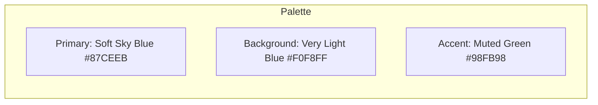
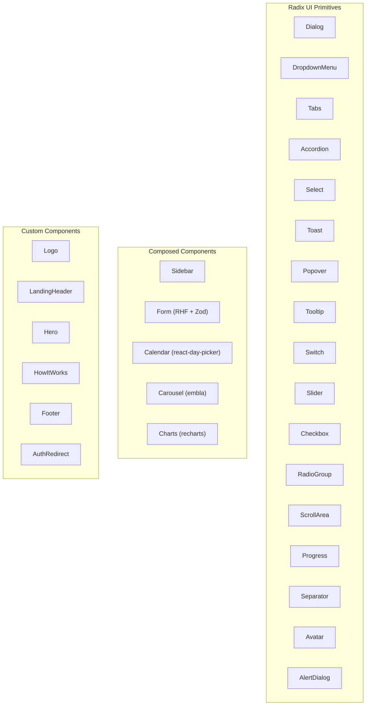
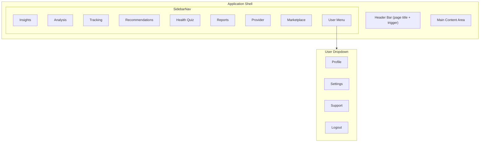
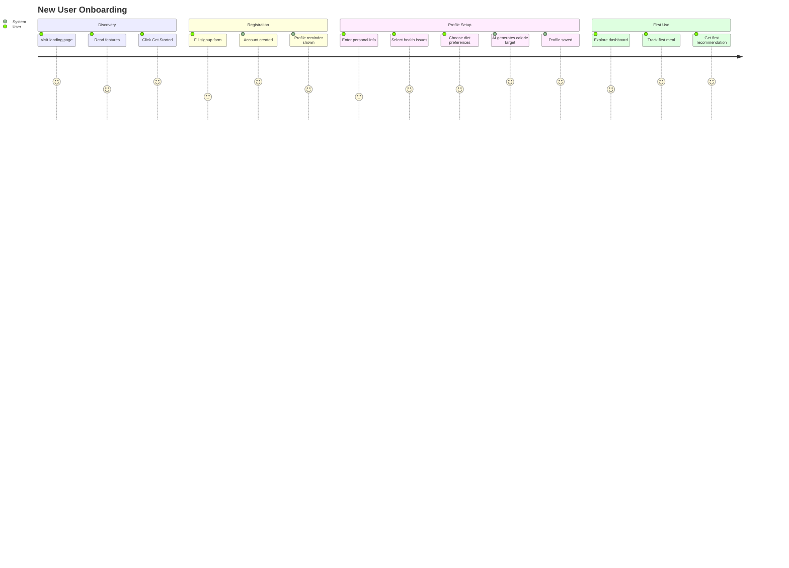
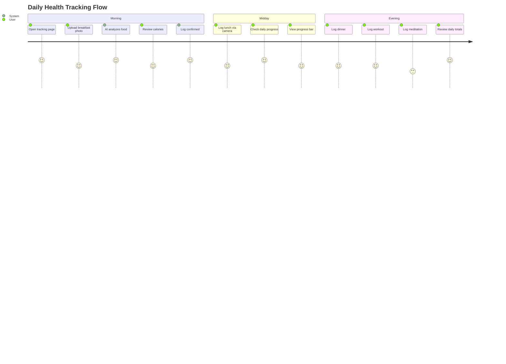
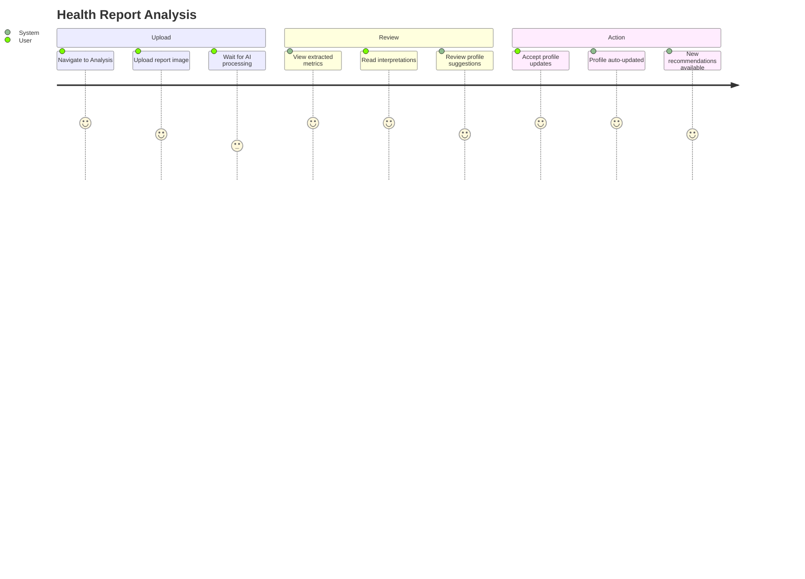

# Design System & UX

## Design Philosophy

HealthGeek follows a calm, approachable health-focused design language that avoids clinical aesthetics while maintaining trust and clarity.

## Color System



| Role | Color | Usage |
|------|-------|-------|
| Primary | `#87CEEB` (Soft Sky Blue) | Trust, well-being, calm |
| Background | `#F0F8FF` (Very Light Blue) | Clarity, non-clinical feel |
| Accent | `#98FB98` (Muted Green) | CTAs, health association |

**Typography**: PT Sans (humanist sans-serif) — modern with warmth.

## Component Library

Built on **shadcn/ui** (Radix UI + Tailwind CSS + class-variance-authority):



## Layout Architecture



## User Journeys

### New User Onboarding



### Daily Health Tracking



### Health Report Analysis



## Page Layouts

### Dashboard Home (Insights)

```
+----------------------------------+
| Sidebar  |  Header: Insights     |
|          |------------------------|
| Nav      |  [Tracking Card]      |
| Items    |  Meals | Workouts |   |
|          |  Meditations          |
|          |                        |
|          |  [Analysis Card]      |
|          |  Health Reports        |
|          |                        |
|          |  [Recommendations]    |
|          |  Recipes | Workouts   |
|          |  Meditations | Habits |
|          |                        |
|          |  [Knowledge Card]     |
|          |  Quizzes Taken         |
+----------------------------------+
```

### Tracking Page (3-Tab Interface)

```
+----------------------------------+
| [Calories] [Workouts] [Meditation]|
|----------------------------------|
| [Track New Meal]     [Search]    |
|----------------------------------|
| Today's Progress:                |
| ████████░░░░ 1200/2000 kcal     |
|----------------------------------|
| History:                         |
| - Chicken Salad  | 350 cal | 12pm|
| - Oatmeal        | 280 cal | 8am |
+----------------------------------+
```

## Responsive Design

- **Desktop**: Full sidebar + content area
- **Mobile**: Collapsible sidebar with trigger button, full-width content
- **Breakpoint**: `md` (768px) for sidebar visibility toggle

## Animation & Motion

Uses **Framer Motion** for:
- Page transitions
- Card hover effects
- Loading states
- Modal entries/exits

## Iconography

**Lucide React** icon set throughout:
- `PieChart` — Insights
- `FileScan` — Analysis
- `ClipboardList` — Tracking
- `Sparkles` — Recommendations
- `BrainCircuit` — Health Quiz
- `Book` — Reports
- `Handshake` — Provider
- `Store` — Marketplace
