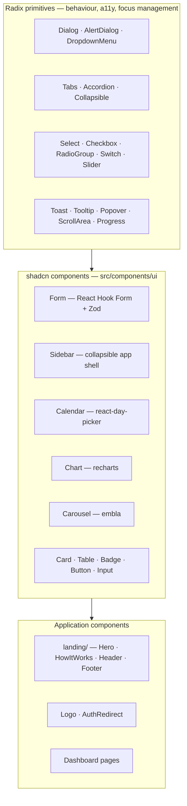
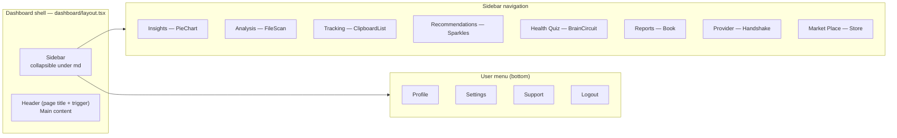
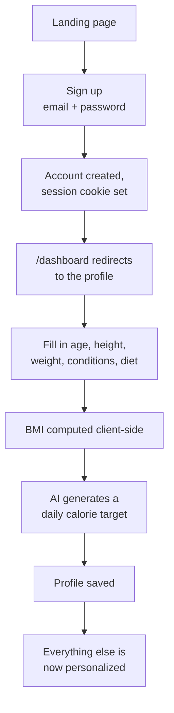
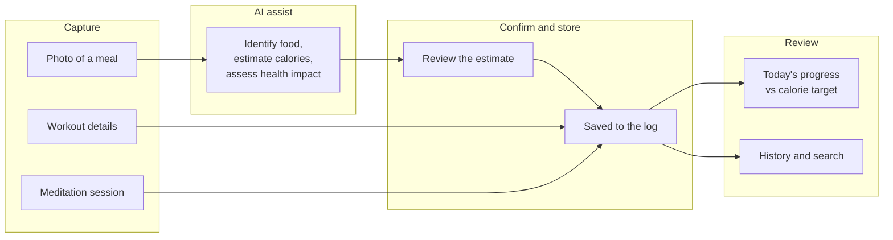
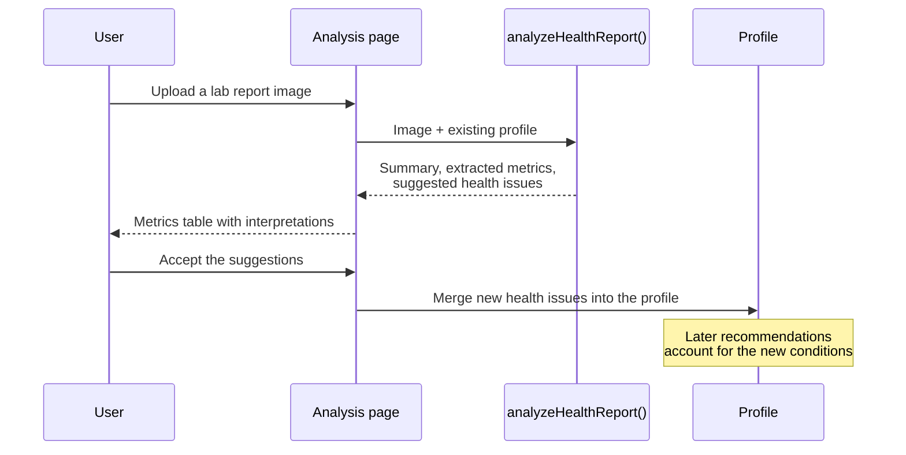
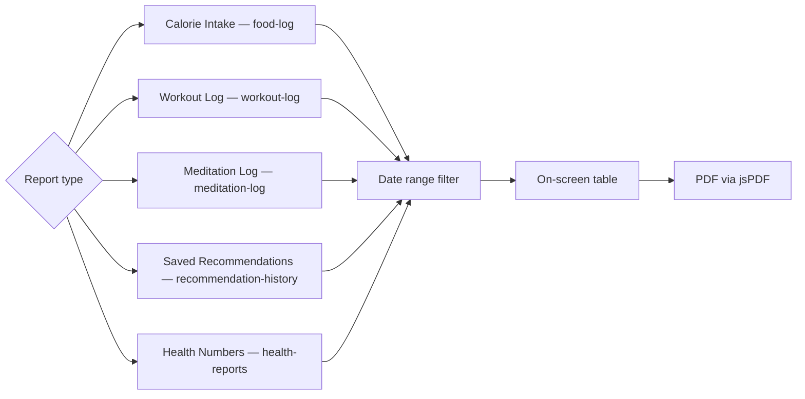

# Design System & UX

A calm, approachable health interface that avoids clinical aesthetics while keeping trust
and clarity. Built on shadcn/ui — Radix primitives for behaviour, Tailwind for styling.

---

## Theme

> **The app is hardcoded to dark mode.** `src/app/layout.tsx` sets
> `<html className="dark">`, there is no toggle, and no theme library is installed. The
> light palette under `:root` in `globals.css` is fully defined but currently unreachable.
> Removing `className="dark"` switches the whole app to the light palette.

Colors are HSL triples in CSS custom properties, consumed by Tailwind through
`tailwind.config.ts`.

| Token | Dark (active) | Light (defined, unused) | Used for |
|---|---|---|---|
| `--background` | `222.2 84% 4.9%` — near-black navy | `208 100% 97%` — very light blue | Page canvas |
| `--foreground` | `210 40% 98%` — near-white | `224 71.4% 4.1%` | Body text |
| `--primary` | `197 50% 60%` — sky blue | `197 71% 73%` | Buttons, active nav, links |
| `--card` | `222.2 84% 4.9%` | `208 100% 99%` | Card surfaces |
| `--muted-foreground` | `215 20.2% 65.1%` | `215.4 16.3% 46.9%` | Secondary text |
| `--destructive` | `0 62.8% 30.6%` | `0 84.2% 60.2%` | Delete actions |

Sky blue as the primary is the one constant across both palettes — chosen to read as calm
and trustworthy rather than clinical.

**Typography:** PT Sans (humanist sans-serif, loaded from Google Fonts), applied via
`--font-body`.

To change the accent color, edit `--primary` in **both** blocks of `globals.css`; every
button, link and active nav item follows.

---

## Component layers

```mermaid
flowchart TB
    subgraph primitives ["Radix primitives — behaviour, a11y, focus management"]
        p1["Dialog · AlertDialog · DropdownMenu"]
        p2["Tabs · Accordion · Collapsible"]
        p3["Select · Checkbox · RadioGroup · Switch · Slider"]
        p4["Toast · Tooltip · Popover · ScrollArea · Progress"]
    end

    subgraph composed ["shadcn components — src/components/ui"]
        c1["Form — React Hook Form + Zod"]
        c2["Sidebar — collapsible app shell"]
        c3["Calendar — react-day-picker"]
        c4["Chart — recharts"]
        c5["Carousel — embla"]
        c6["Card · Table · Badge · Button · Input"]
    end

    subgraph app ["Application components"]
        a1["landing/ — Hero · HowItWorks · Header · Footer"]
        a2["Logo · AuthRedirect"]
        a3["Dashboard pages"]
    end

    primitives --> composed --> app
```

These are **vendored, not installed** — `src/components/ui/*` is source you own and can
edit. `components.json` records the shadcn config used to generate them.

---

## Layout

```mermaid
flowchart LR
    subgraph shell ["Dashboard shell — dashboard/layout.tsx"]
        sidebar["Sidebar<br/>collapsible under md"]
        main["Header (page title + trigger)<br/>Main content"]
    end

    subgraph nav ["Sidebar navigation"]
        n1["Insights — PieChart"]
        n2["Analysis — FileScan"]
        n3["Tracking — ClipboardList"]
        n4["Recommendations — Sparkles"]
        n5["Health Quiz — BrainCircuit"]
        n6["Reports — Book"]
        n7["Provider — Handshake"]
        n8["Market Place — Store"]
    end

    subgraph menu ["User menu (bottom)"]
        m1["Profile"]
        m2["Settings"]
        m3["Support"]
        m4["Logout"]
    end

    sidebar --> nav
    sidebar --> menu
```

The layout also owns the **auth gate**: it subscribes to auth state, redirects to `/login`
when signed out, creates a blank profile on first sign-in, and nudges users with an
incomplete profile toward `/dashboard/profile`.

`/dashboard` itself has no UI — it redirects to `/dashboard/profile`.

**Responsive:** the sidebar collapses below the `md` breakpoint (768px) behind a trigger
button; content goes full width.

---

## User journeys

### First run

```mermaid
flowchart TD
    a["Landing page"] --> b["Sign up<br/>email + password"]
    b --> c["Account created,<br/>session cookie set"]
    c --> d["/dashboard redirects<br/>to the profile"]
    d --> e["Fill in age, height,<br/>weight, conditions, diet"]
    e --> f["BMI computed client-side"]
    f --> g["AI generates a<br/>daily calorie target"]
    g --> h["Profile saved"]
    h --> i["Everything else is<br/>now personalized"]
```

The profile is the hinge: every AI flow takes `userProfile` as input, so recommendations
are generic until it is filled in. That is why the layout nags about it.

### Daily tracking

```mermaid
flowchart LR
    subgraph capture ["Capture"]
        p["Photo of a meal"]
        w["Workout details"]
        m["Meditation session"]
    end
    subgraph assist ["AI assist"]
        a["Identify food,<br/>estimate calories,<br/>assess health impact"]
    end
    subgraph confirm ["Confirm and store"]
        r["Review the estimate"]
        s["Saved to the log"]
    end
    subgraph review ["Review"]
        t["Today's progress<br/>vs calorie target"]
        h["History and search"]
    end

    p --> a --> r --> s
    w --> s
    m --> s
    s --> t
    s --> h
```

Nothing is stored until the user confirms — the AI proposes, the user commits.

### Lab report analysis

```mermaid
sequenceDiagram
    participant U as User
    participant A as Analysis page
    participant AI as analyzeHealthReport()
    participant P as Profile

    U->>A: Upload a lab report image
    A->>AI: Image + existing profile
    AI-->>A: Summary, extracted metrics,<br/>suggested health issues
    A-->>U: Metrics table with interpretations
    U->>A: Accept the suggestions
    A->>P: Merge new health issues into the profile
    Note over P: Later recommendations<br/>account for the new conditions
```

The loop that makes the app cohere: a report changes the profile, and the profile changes
every future recommendation.

---

## Page patterns

| Page | Pattern |
|---|---|
| Insights | Read-only stat cards grouped by Tracking / Analysis / Recommendations / Knowledge |
| Tracking | Three tabs (Calorie · Workout · Meditation), each with Today's Log and History sub-tabs |
| Analysis | Upload-and-analyze panels, results rendered as tables and cards |
| Recommendations | Saved-history list → "New Recommendation" → four generator tabs → result with Save / Share |
| Health Quiz | Configure → generate → answer → score → save |
| Reports | Report type + date range → generate → preview table → PDF export |
| Profile | One long form: identity, measurements, diet, and a large grouped health-issue checklist |

Recurring conventions: destructive actions go through an `AlertDialog`; every mutation
ends in a toast; loading states use a spinner inside the triggering button.

### Reports

Five report types, each reading one collection over a date range:

```mermaid
flowchart LR
    t{"Report type"} --> c["Calorie Intake — food-log"]
    t --> w["Workout Log — workout-log"]
    t --> m["Meditation Log — meditation-log"]
    t --> r["Saved Recommendations — recommendation-history"]
    t --> h["Health Numbers — health-reports"]
    c & w & m & r & h --> d["Date range filter"] --> v["On-screen table"] --> p["PDF via jsPDF"]
```

---

## Iconography and motion

**Lucide React**, imported per icon. Navigation mapping: `PieChart` Insights · `FileScan`
Analysis · `ClipboardList` Tracking · `Sparkles` Recommendations · `BrainCircuit` Health
Quiz · `Book` Reports · `Handshake` Provider · `Store` Marketplace.

**Framer Motion** is installed and used sparingly — card and section transitions. Most
motion comes from Radix's own data-state animations via Tailwind classes.

---

## Extending the UI

| Task | Where |
|---|---|
| Change the accent color | `--primary` in both blocks of `globals.css` |
| Switch to the light theme | Remove `className="dark"` from `app/layout.tsx` |
| Add a nav item | A `<Link>` in `dashboard/layout.tsx`, plus the route folder |
| Add a shadcn component | `npx shadcn@latest add <name>` — lands in `components/ui/` |
| Change fonts | The Google Fonts link in `app/layout.tsx` and `--font-body` |
