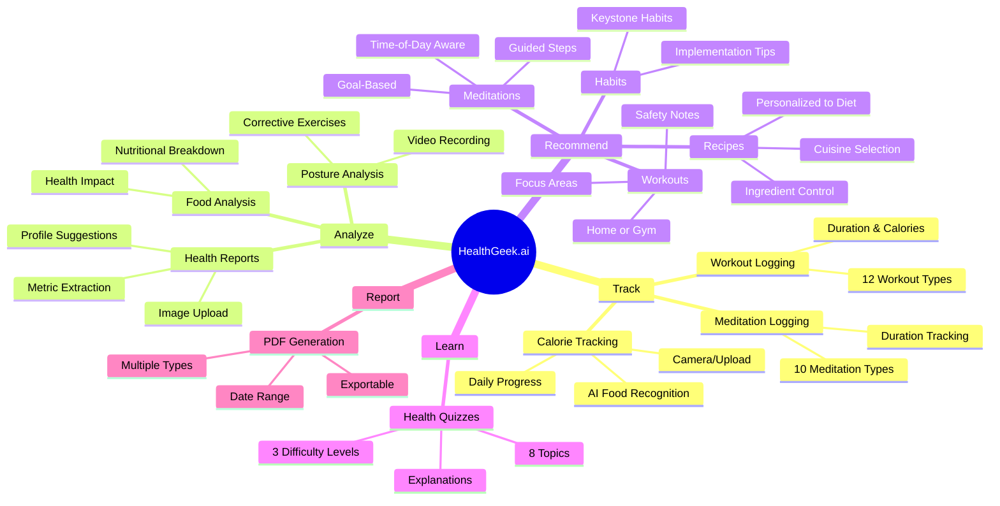
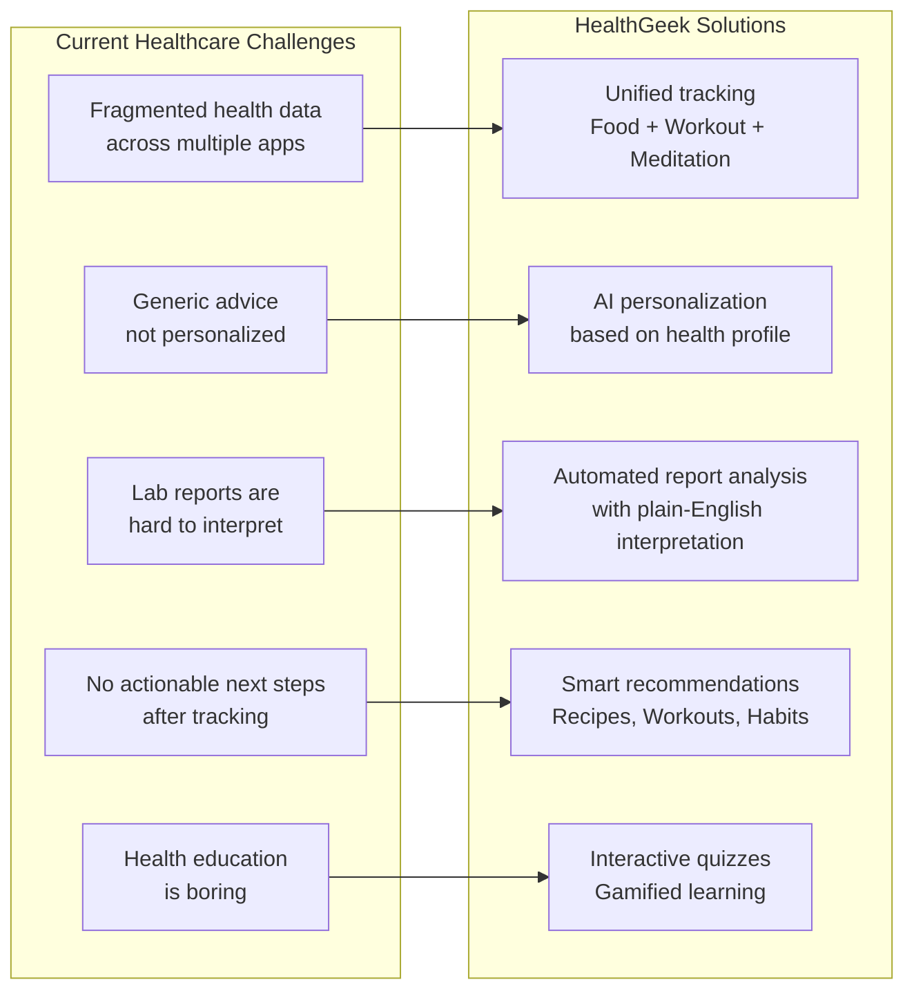
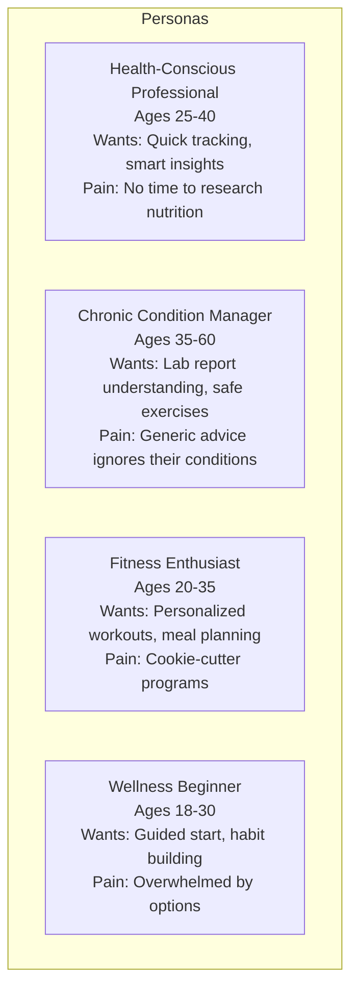
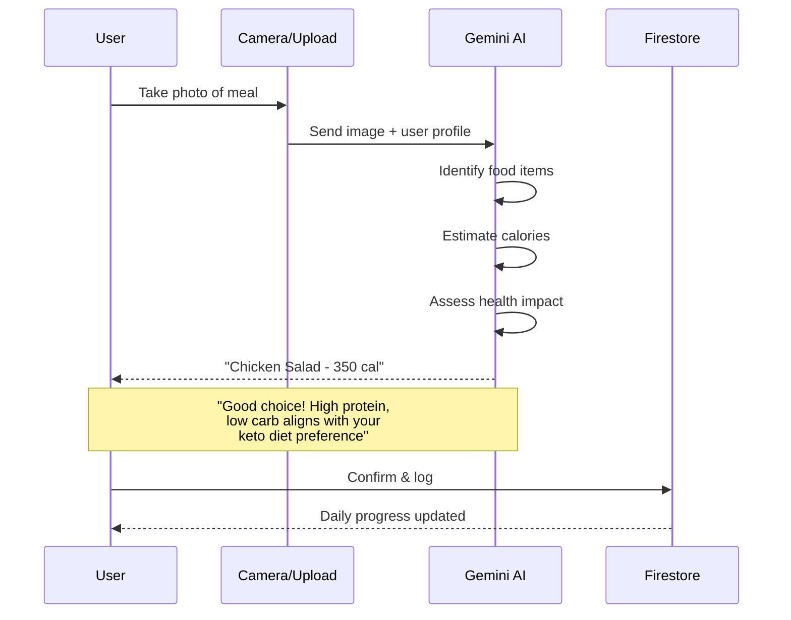
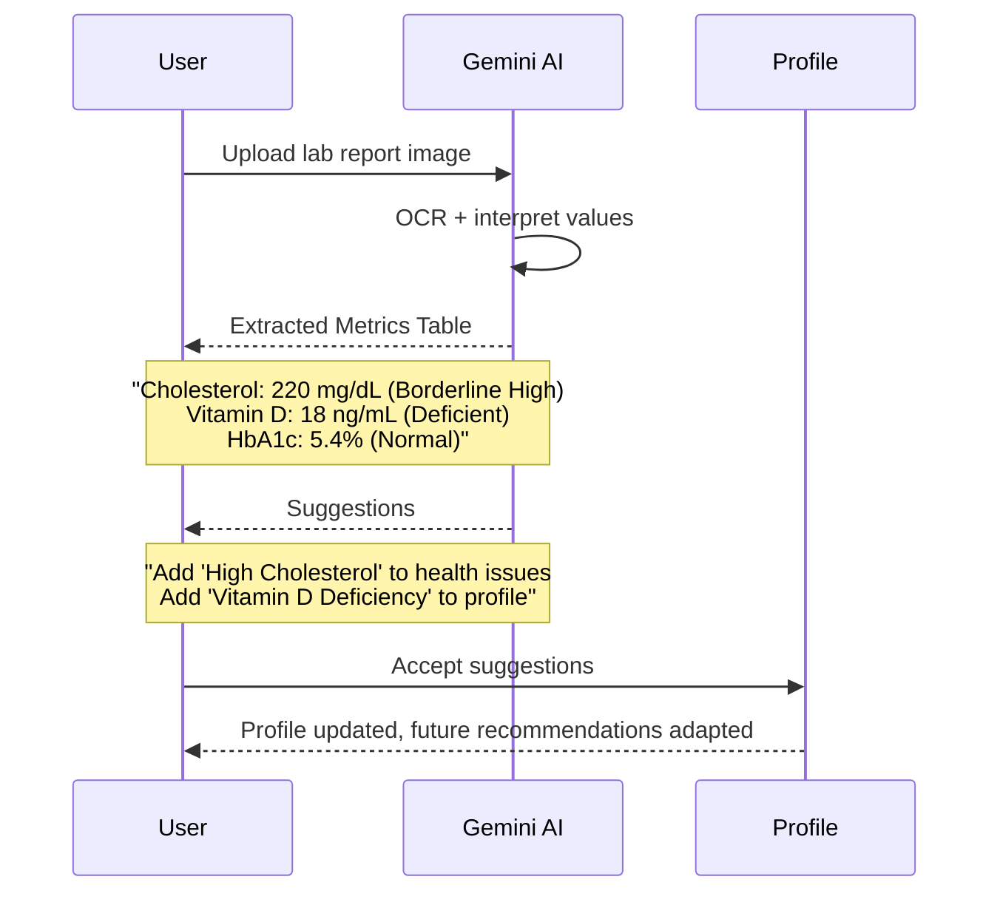
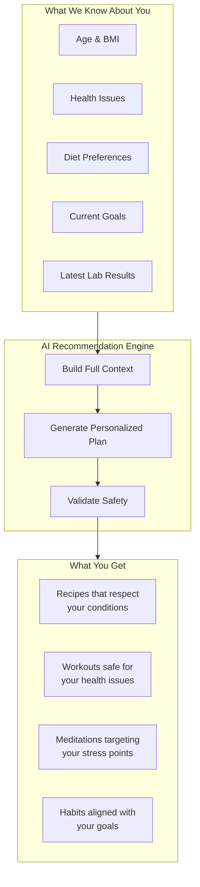
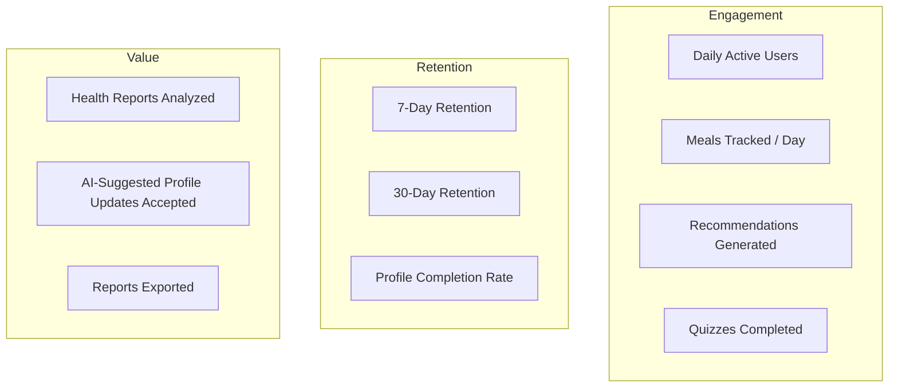
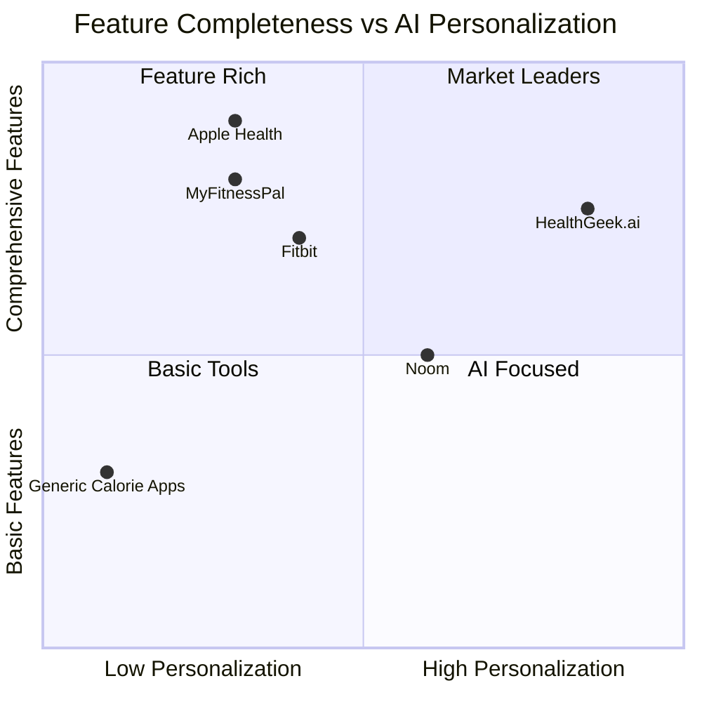
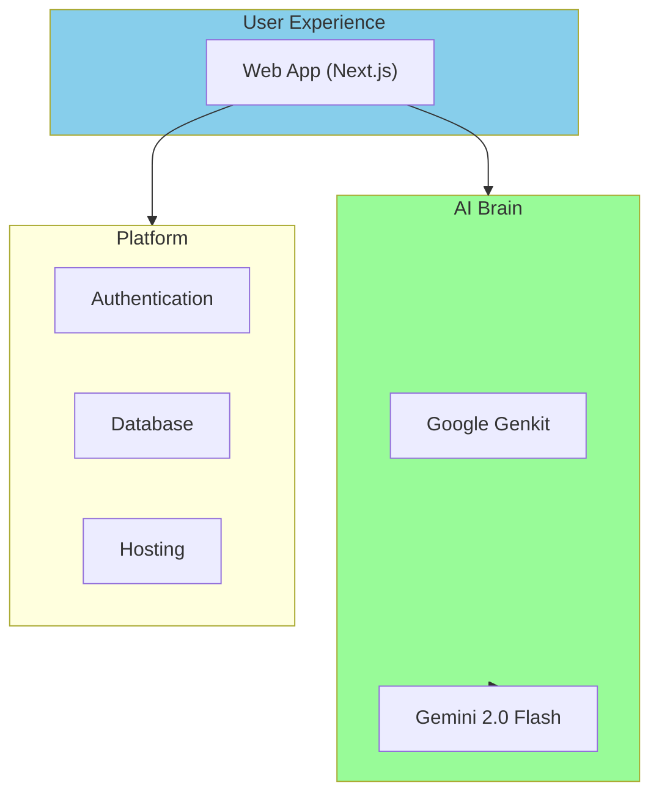
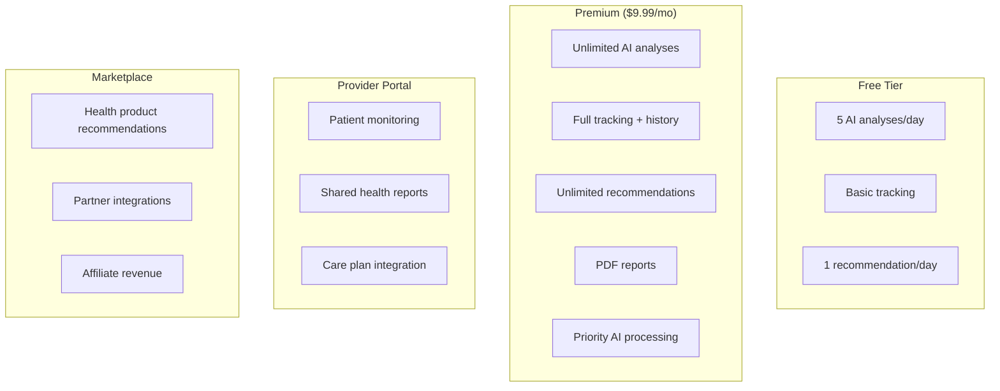

# HealthGeek.ai — Product Presentation

## Elevator Pitch

> **HealthGeek.ai** is an AI-powered personal healthcare platform that combines daily health tracking, intelligent analysis, and personalized recommendations — making proactive health management accessible to everyone.

---

## Product Overview



---

## Problem Statement



---

## Key Differentiators

| Feature | Traditional Apps | HealthGeek.ai |
|---------|-----------------|---------------|
| Food Logging | Manual calorie entry | AI photo recognition |
| Health Reports | Store PDFs | AI extracts + interprets metrics |
| Recommendations | Same for everyone | Personalized to profile + conditions |
| Posture | Not available | Video analysis with corrections |
| Education | Articles | Interactive AI quizzes |
| Data Export | Limited | PDF reports with date ranges |

---

## User Personas



---

## Feature Deep Dives

### AI-Powered Food Tracking



### Health Report Intelligence



### Personalized Recommendations Engine



---

## Product Metrics



---

## Competitive Landscape



---

## Technical Architecture (Simplified)



---

## Roadmap

```mermaid
gantt
    title HealthGeek.ai Product Roadmap
    dateFormat YYYY-Q
    axisFormat %Y-Q%q

    section Core Platform
        Food Tracking (AI)        :done, 2024-Q1, 2024-Q2
        Workout & Meditation Log  :done, 2024-Q2, 2024-Q3
        Health Report Analysis    :done, 2024-Q3, 2024-Q4
        Recommendations Engine    :done, 2024-Q4, 2025-Q1

    section Growth Features
        Health Quizzes            :done, 2025-Q1, 2025-Q2
        PDF Reports               :done, 2025-Q1, 2025-Q2
        Posture Analysis          :done, 2025-Q2, 2025-Q3

    section Upcoming
        Provider Portal           :active, 2025-Q3, 2025-Q4
        Marketplace               :2025-Q4, 2026-Q1
        Wearable Integration      :2026-Q1, 2026-Q2
        Community Features        :2026-Q2, 2026-Q3
        Mobile App (React Native) :2026-Q3, 2026-Q4
```

---

## Demo Script

### 5-Minute Product Demo

1. **Landing & Signup** (30s)
   - Show landing page, click "Get Started"
   - Quick signup with email

2. **Profile Setup** (60s)
   - Fill in health details
   - Select health issues (diabetes, high cholesterol)
   - Choose diet (keto)
   - Watch AI generate calorie target

3. **Food Tracking** (60s)
   - Navigate to Tracking
   - Take photo of a meal
   - Show AI identifying food + calorie estimate
   - Show health impact message personalized to conditions
   - View daily progress bar

4. **Health Report Analysis** (60s)
   - Navigate to Analysis
   - Upload sample lab report
   - Show extracted metrics with interpretations
   - Accept profile update suggestion
   - Note: "Future recommendations now account for this"

5. **Get Recommendation** (60s)
   - Navigate to Recommendations
   - Generate a workout (home, 30min, core focus)
   - Show personalized plan respecting health conditions
   - Save to history, download PDF

6. **Reports** (30s)
   - Show PDF export with date range
   - Quick view of aggregated health data

---

## Business Model (Future)



---

## Contact & Links

| Resource | Location |
|----------|----------|
| Repository | This repo |
| Deployed App | Firebase App Hosting |
| AI Flows Dev | `npm run genkit:dev` |
| Documentation | `docs/` directory |
