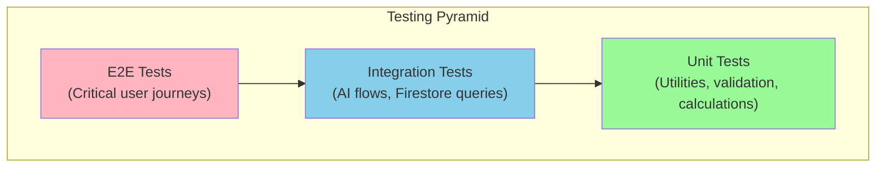
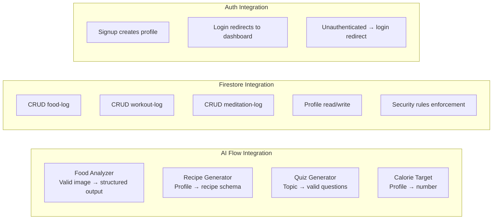
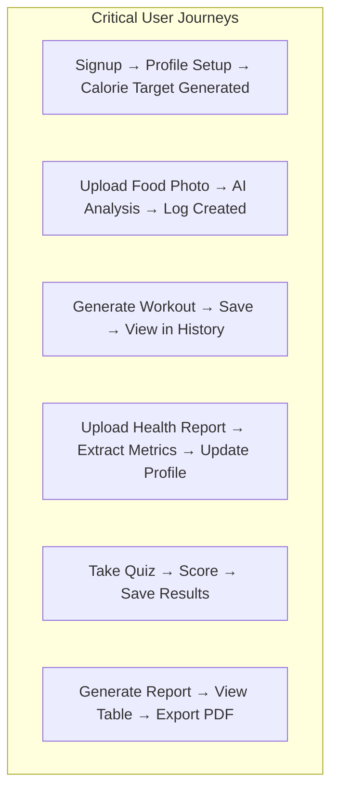
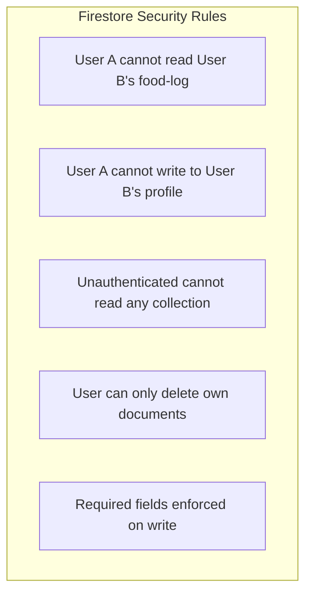
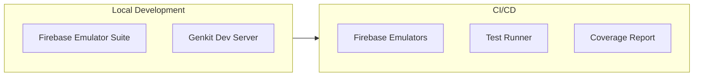

# Testing Strategy

## Overview

Testing strategy for HealthGeek covering all application layers.



## Test Categories

### Unit Tests

Target: Pure functions, utilities, validation schemas, calculations.

| Area | What to Test | Example |
|------|-------------|---------|
| BMI Calculation | Height/weight → BMI formula | Profile page auto-calc |
| Zod Schemas | Input validation for all forms | Login, signup, tracking forms |
| `cn()` utility | Class merging behavior | Conditional styling |
| Date formatting | Display formats for logs | History lists |
| Calorie math | Daily total calculations | Progress bar percentage |

### Integration Tests

Target: AI flows, Firestore operations, authentication.



### End-to-End Tests

Target: Full user journeys through the browser.



## Test Plan by Feature

### Authentication

| Test Case | Type | Expected |
|-----------|------|----------|
| Valid signup creates account + profile | Integration | Profile doc exists in Firestore |
| Duplicate email shows error | Integration | Firebase auth error displayed |
| Valid login redirects to dashboard | Integration | URL = /dashboard |
| Invalid credentials show error | Integration | Error toast shown |
| Unauthenticated access redirects | E2E | URL = /login |
| Logout clears session | E2E | Redirected to /login |

### Food Tracking

| Test Case | Type | Expected |
|-----------|------|----------|
| Valid food photo returns analysis | Integration | { foodName, calories, healthImpact } |
| Logged meal appears in history | E2E | Item in food-log list |
| Daily total updates after logging | E2E | Progress bar reflects new total |
| Delete removes from history | E2E | Item no longer visible |
| Search filters by food name | E2E | Only matching items shown |
| Exceeding target shows warning | E2E | Warning message visible |

### AI Recommendations

| Test Case | Type | Expected |
|-----------|------|----------|
| Workout generator returns valid plan | Integration | Schema-valid structured output |
| Meditation includes all steps | Integration | steps[] non-empty |
| Recipe respects dietary restrictions | Integration | No excluded ingredients |
| Habit plan has 3-5 habits | Integration | habits.length between 3-5 |
| Saved recommendation appears in history | E2E | Item in list |
| Rating persists on refresh | E2E | Stars still filled |

### Health Report Analysis

| Test Case | Type | Expected |
|-----------|------|----------|
| Report image → extracted metrics | Integration | extractedMetrics[] non-empty |
| Profile suggestions are actionable | Integration | field + value present |
| Accepting suggestion updates profile | E2E | Profile doc updated |

### Reports & PDF

| Test Case | Type | Expected |
|-----------|------|----------|
| Date range filters data correctly | E2E | Only items in range shown |
| PDF downloads successfully | E2E | File download triggered |
| Empty range shows no-data message | E2E | Informative message |

## Security Testing



| Rule | Test |
|------|------|
| Owner-only read | Query with wrong userId returns empty |
| Owner-only write | Write with wrong userId is denied |
| No unauthenticated access | Request without auth token is denied |
| Cross-user isolation | User A's query never returns User B's data |

## Performance Testing

| Metric | Target | How to Measure |
|--------|--------|----------------|
| First Contentful Paint | < 1.5s | Lighthouse |
| AI flow response time | < 5s | Genkit metrics |
| Firestore query latency | < 200ms | Firebase console |
| PDF generation | < 3s | Manual timing |
| Image upload + analysis | < 8s | E2E timing |

## Test Environment Setup



### Running Tests

```bash
# Unit tests
npm test

# Integration tests (requires Firebase emulators)
firebase emulators:start
npm run test:integration

# E2E tests
npm run test:e2e

# Security rules tests
firebase emulators:start
npm run test:rules
```

## Coverage Goals

| Layer | Target |
|-------|--------|
| Unit (utilities, schemas) | 90% |
| Integration (AI flows) | 80% |
| Integration (Firestore) | 85% |
| E2E (critical paths) | 100% of journeys |
| Security rules | 100% of rules |
