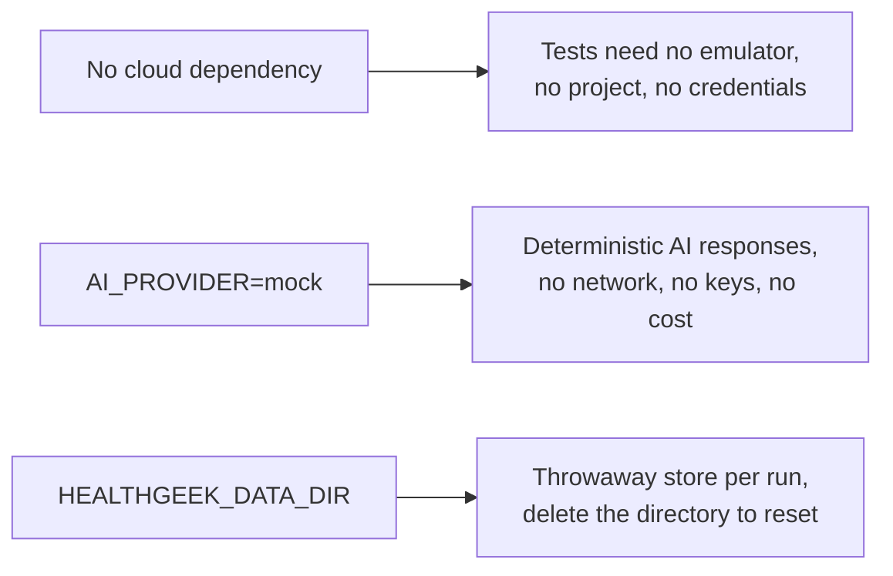
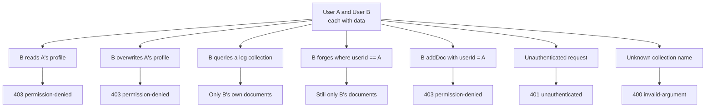
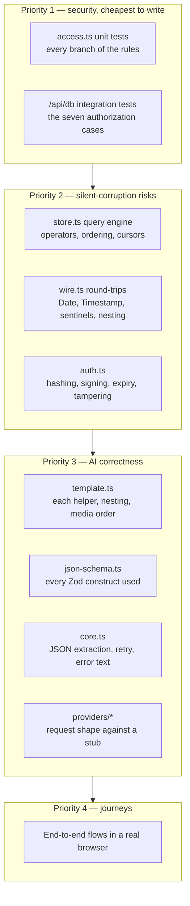

# Testing

> **State of play:** this repository has **no automated test suite** — no test files, no
> test runner, no `npm test` script. What follows is (1) a manual verification pass you can
> actually run today, and (2) the suite worth building, in priority order. Nothing here
> describes tests that exist.

---

## What makes this app easy to test


```mermaid
flowchart LR
    a["No cloud dependency"] --> d["Tests need no emulator,<br/>no project, no credentials"]
    b["AI_PROVIDER=mock"] --> e["Deterministic AI responses,<br/>no network, no keys, no cost"]
    c["HEALTHGEEK_DATA_DIR"] --> f["Throwaway store per run,<br/>delete the directory to reset"]
```

The whole environment for a test run is two environment variables:

```bash
HEALTHGEEK_DATA_DIR=./.test-data AI_PROVIDER=mock npx next dev -p 9200
rm -rf ./.test-data     # full reset
```

---

## Manual verification pass

Run these against a fresh data directory. This is the exact sequence used to verify the
migration off Firebase; it covers every layer.

### 1. Auth

| Check | How | Expected |
|---|---|---|
| Signup | `POST /api/auth/signup` with email + password | `200` and `{ user: { uid, email } }` |
| Email is normalized | Sign up as `Alice@Example.com` | Stored and returned lowercase |
| Duplicate email | Sign up twice | `409 email-already-in-use` |
| Weak password | Password under 6 chars | `400 weak-password` |
| Login | `POST /api/auth/login` | `200`, cookie set |
| Wrong password | Bad password | `401 invalid-credential` |
| Unknown email | Nonexistent address | `401 invalid-credential` — same as wrong password |
| Session | `GET /api/auth/session` | The signed-in user, or `{ user: null }` |
| Logout | `POST /api/auth/logout` | Session becomes null |
| Tampered cookie | Send `healthgeek_session=abc.badsignature` | `401` |
| Password storage | Inspect `healthgeek.json` | Only `passwordHash` + `passwordSalt`; never plaintext |

### 2. Documents and queries

| Check | Expected |
|---|---|
| `setDoc` then `getDoc` on `profiles/{uid}` | Round-trips unchanged |
| `setDoc` with `{ merge: true }` | Unlisted fields survive |
| `addDoc` returns an id | Document is retrievable by it |
| `updateDoc` | Only the named fields change |
| `deleteDoc` | Subsequent `getDoc` returns `null` |
| `new Date()` written | Comes back as a `Timestamp` with `.toDate()` |
| `serverTimestamp()` | Resolved to the server clock, not the client's |
| Range query on `timestamp` | Only in-range documents |
| `orderBy('timestamp','desc')` | Newest first |
| `limit(n)` | At most `n`, applied after sorting |
| `orderBy(f) + startAt(t) + endAt(t+'')` | Prefix match |
| `endAt(t)` alone | Exact upper bound — usually empty |

### 3. Authorization

This is the part worth being paranoid about. Create two users and try to cross the line.


```mermaid
flowchart TD
    setup["User A and User B<br/>each with data"] --> t1["B reads A's profile"]
    setup --> t2["B overwrites A's profile"]
    setup --> t3["B queries a log collection"]
    setup --> t4["B forges where userId == A"]
    setup --> t5["B addDoc with userId = A"]
    setup --> t6["Unauthenticated request"]
    setup --> t7["Unknown collection name"]

    t1 --> r1["403 permission-denied"]
    t2 --> r2["403 permission-denied"]
    t3 --> r3["Only B's own documents"]
    t4 --> r4["Still only B's documents"]
    t5 --> r5["403 permission-denied"]
    t6 --> r6["401 unauthenticated"]
    t7 --> r7["400 invalid-argument"]
```

All seven currently behave as shown. Re-run them after **any** change to
`server/access.ts` or `api/db/route.ts` — that file pair is the entire security model.

### 4. The AI layer

| Check | How | Expected |
|---|---|---|
| Mock provider | `AI_PROVIDER=mock` | Schema-valid `"Sample …"` data on every flow |
| Schema validation | Point at a stub returning the wrong shape | One retry, then `AiError` naming the failed fields |
| Templates | `{{#each}}` with `{{#unless @last}}` | Comma-separated list, no trailing comma |
| Conditionals | `{{#if}}` with an absent and a blank value | Block omitted in both cases |
| Media ordering | `{{media url=…}}` mid-prompt | Parts stay in order: text, media, text |
| Request shape | Stub endpoint, inspect the body | Correct auth header, JSON mode, schema in system prompt, image as a data URI |
| Unsupported media | Send video to a non-Gemini provider | Explicit "could not review the attachment" note in the prompt |

A stub provider is the cheapest way to test adapters — a tiny HTTP server that records the
request body and returns a canned response, with `AI_BASE_URL` pointed at it.

### 5. UI journey

Sign up → fill the profile → save → reload (values persist, BMI recalculated) → Tracking →
Add Workout → entry appears in Today's Log → Insights counts it → Recommendations →
generate → Save to History → appears in the saved list → logout → visiting `/dashboard`
redirects to `/login`.

Watch the browser console throughout: it should stay empty. Any 4xx on `/api/db` during a
normal journey is a bug.

---

## The suite worth building


```mermaid
flowchart TB
    subgraph p1 ["Priority 1 — security, cheapest to write"]
        a1["access.ts unit tests<br/>every branch of the rules"]
        a2["/api/db integration tests<br/>the seven authorization cases"]
    end
    subgraph p2 ["Priority 2 — silent-corruption risks"]
        b1["store.ts query engine<br/>operators, ordering, cursors"]
        b2["wire.ts round-trips<br/>Date, Timestamp, sentinels, nesting"]
        b3["auth.ts<br/>hashing, signing, expiry, tampering"]
    end
    subgraph p3 ["Priority 3 — AI correctness"]
        c1["template.ts<br/>each helper, nesting, media order"]
        c2["json-schema.ts<br/>every Zod construct used"]
        c3["core.ts<br/>JSON extraction, retry, error text"]
        c4["providers/*<br/>request shape against a stub"]
    end
    subgraph p4 ["Priority 4 — journeys"]
        d1["End-to-end flows in a real browser"]
    end

    p1 --> p2 --> p3 --> p4
```

**Priority 1 first** because `access.ts` is small, pure, and the only thing standing between
one user's data and another's. It is under 90 lines with no I/O — ideal unit-test surface.

Suggested tooling, none of it currently installed:

| Layer | Tool | Why |
|---|---|---|
| Unit | Vitest | Fast, TypeScript-native, no config for this layout |
| API integration | Vitest + `fetch` against a dev server | The API is plain HTTP; no framework needed |
| Browser | Playwright | Runs headless in CI, no extension required |

### Sketch of a first test

```typescript
// src/lib/server/access.test.ts
import { scopeQueryConstraints } from './access';

it('replaces a forged userId filter with the caller uid', () => {
  const out = scopeQueryConstraints(
    'food-log',
    [{ type: 'where', field: 'userId', op: '==', value: 'victim' }],
    'attacker',
  );
  expect(out).toEqual([{ type: 'where', field: 'userId', op: '==', value: 'attacker' }]);
});

it('refuses to query profiles', () => {
  expect(() => scopeQueryConstraints('profiles', [], 'uid')).toThrow(/one document at a time/);
});
```

---

## Coverage targets

Aspirational — there is no coverage to report yet.

| Layer | Target | Rationale |
|---|---|---|
| `server/access.ts` | 100% of branches | It is the security model |
| `server/store.ts` | 90% | Silent wrong answers are worse than crashes |
| `data/wire.ts` | 90% | A codec bug corrupts stored data |
| `ai/template.ts`, `ai/json-schema.ts` | 85% | Pure functions, cheap to cover |
| `ai/providers/*` | Request shape per provider | Catches vendor drift |
| Pages | Journeys only | High churn, low unit-test value |

---

## CI notes

No workflow is configured. When one is added, the useful minimum is:

```bash
npm ci
npm run typecheck          # currently clean from a cold .next
npm run build
# once tests exist:
HEALTHGEEK_DATA_DIR=$(mktemp -d) AI_PROVIDER=mock npm test
```

Two gotchas. `npm run build` will **not** fail on type errors — `next.config.ts` ignores
them — so `typecheck` has to be its own step. And `npm run lint` currently blocks on
ESLint's interactive setup prompt, so it cannot go in CI until ESLint is configured.
